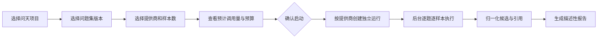
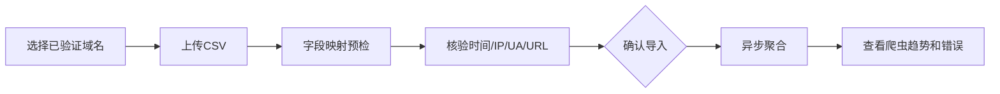
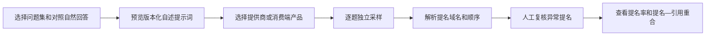
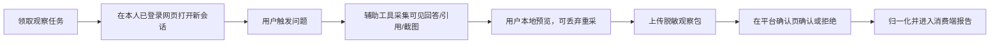
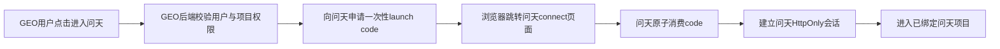

# “问天”AI信源探测系统：产品需求与UI/交互设计

> 文档状态：已批准（`CHG-VIS-002`）  
> 产品形态：完整独立系统＋GEO薄连接器  
> 核心入口：问天Web；GEO入口通过一次性SSO跳转到问天

## 1. 背景与问题

企业能够看到某次 AI 回答引用了哪些网页，但通常无法稳定回答以下问题：

1. 同一问题重复提问时，哪些域名经常进入搜索候选？
2. 哪些域名最终被引用，引用位置和覆盖意图如何？
3. 自有网站没有被引用，是未被爬取、未进入候选，还是进入候选但未被采用？
4. 内容发布或修改后，信源表现是否发生变化？
5. 不同 AI 搜索接口的信源构成是否存在稳定差异？
6. AI 声称应优先参考哪些权威来源，这种声明与其实际引用是否一致？
7. 没有正式 API 时，消费端网页实际向用户展示了哪些回答与可见引用？

现有 AI 可见度体检主要测量模型记忆中的品牌提及，不能回答联网信源问题。本项目建设完整独立的“问天”AI信源探测系统，并通过薄连接器与GEO Content OS建立入口、身份和项目上下文集成。

## 2. 产品目标

### 2.1 业务目标

- 把“AI 是否引用我”转化为可重复、可追溯、可按时间比较的测量过程。
- 找出高商业价值问题中稳定出现的第三方信源、竞品信源和自有站点缺口。
- 区分站点访问、搜索候选、最终引用三个环节，避免错误归因。
- 区分“AI 自述的信源推荐”与“实际可见引用”，测量两者的一致和偏离。
- 在没有正式 API 时，以人工确认的消费端观察补充产品真实界面证据。
- 为内容选题、资料建设和技术可访问性优化提供证据，不自动承诺排名提升。
- 问天在不依赖GEO的情况下完整运行；GEO只通过公开集成API接入，不形成第二套业务系统。

### 2.2 用户目标

分析师能够在 10 分钟内完成：选择问题集 → 选择自然回答或信源自述实验 → 选择探测提供商 → 设置样本数 → 启动运行 → 查看来源分布和逐题证据。

消费端观察员能够按系统任务在自己的已登录网页中完成一次问题采集，预览可见回答、引用和截图，确认后提交，不向平台提供账号密码或 Cookie。

站点运营人员能够导入一天或一周的访问日志，并判断已验证 AI 爬虫访问了哪些栏目、频率和抓取成功率。

### 2.3 成功标准

MVP 上线后满足：

- 100% 的联网探测结果可追溯到问题、提供商、模型、运行配置、时间和原始响应。
- 100% 的来源统计可下钻到具体响应和提供商返回的URL。
- “搜索候选”“最终引用”“爬虫访问”在数据、接口和UI中使用不同字段与标签。
- “信源提名”和“最终引用”使用不同事件角色，自述结果不进入实际引用率。
- 100% 的消费端观察记录包含产品界面、采集方式、时间、问题、可见回答、人工确认状态和证据等级；无法确认的字段明确为未知。
- 同一URL的常见追踪参数差异不会造成重复计数。
- 没有服务器日志时，系统不展示“爬取频率”结论。
- 任一提供商失败不覆盖已成功样本；部分成功可以形成报告并明确样本基数。

## 3. 非目标

MVP 不实现：

- 推断 AI 内部未公开的排序权重或训练数据权重；
- 自动登录、模拟点击或批量抓取消费端 AI 网页；
- 绕过验证码、付费墙、robots.txt 或访问控制；
- 抓取并长期保存第三方引用网页正文；
- 通过一次运行给出“行业权威排名”；
- 自动修改网站内容、自动发布内容或自动向外部平台发送消息；
- 用API结果冒充 ChatGPT、Gemini、Perplexity 消费产品的真实界面结果。
- 把 AI 对“应该参考哪些来源”的回答解释为内部爬取统计或真实排序权重。
- 通过浏览器辅助工具获取账号密码、Cookie、会话Token或不可见的内部页面数据。
- 在GEO中复制问天页面、Worker、数据库表、指标算法或Provider Adapter。
- 在MVP中把独立部署扩展为公共多租户SaaS、独立计费平台或插件市场。

## 4. 用户与权限

| 用户 | 主要任务 | 权限 |
|---|---|---|
| 组织所有者/管理员 | 配额、保留期、项目范围 | 查看、配置、运行、导出 |
| 分析师 | 问题集、探测、结果分析、日志导入 | 查看、创建、运行、导入、导出 |
| 策略编辑 | 查看来源机会并创建或导出Brief | 查看、导出；已连接GEO时可按权限回传机会 |
| 只读成员 | 查看授权项目报告 | 只读 |
| 系统运营 | 发布提供商能力配置和方法版本 | 不默认读取项目原始回答 |

问天MVP只有一个本地组织，可包含多个项目。一个问天实例最多绑定一个GEO租户，可绑定该租户下多个工作区和项目；多GEO租户接入不在MVP。项目是权限和数据隔离边界，客户端提交的project/scope ID不能证明访问权。GEO用户通过连接器SSO进入后，仍映射为问天用户和项目角色，由问天服务端完成最终授权；同一用户在不同项目的角色分别映射，不得共用。

## 5. 核心概念

| 概念 | 定义 |
|---|---|
| 问题集 | 版本化的用户问题集合，包含意图、商业价值、语言和市场 |
| 探测运行 | 一个问题集版本在一个提供商、一个模型和一组固定配置下的执行 |
| 样本 | 同一问题在同一运行中的一次独立回答 |
| 搜索候选 | 提供商明确返回、可能进入生成上下文的搜索结果 |
| 最终引用 | 提供商明确标注为回答引用或归因的来源 |
| 来源 | 归一化后的域名与URL，不等同于网页内容事实 |
| 信源提名 | AI 在自述实验中声明“应当参考”的域名，不表示本次实际检索或引用 |
| 信源自述实验 | 使用版本化元提示词测量信源提名和声明偏好 |
| 消费端观察 | 对消费端网页可见回答、引用和来源面板的人工确认记录 |
| 采集方式 | `provider_api | browser_assisted | manual_import`，决定证据等级和可自动化范围 |
| 自述上下文 | `unaided | search_assisted | surface_unknown`，区分未启用搜索、明确启用搜索和消费端模式未知的信源提名 |
| 人工确认状态 | `not_required | needs_review | confirmed | rejected`，描述记录是否需要及是否通过人工确认 |
| 证据等级 | `api_structured | web_confirmed_capture | web_confirmed_manual | imported_declared`，描述证据如何产生，不代替确认状态 |
| 爬虫访问 | 自有日志中经官方IP与User-Agent规则核验的HTTP请求 |
| 信源倾向 | 在给定问题集、提供商、时间和样本范围内，来源成为候选或引用的观察频率 |
| 项目Scope | 问天的授权与数据隔离单位，一个项目对应一个内部scope |
| GEO连接器 | GEO侧薄集成与问天Integration API的组合，只负责SSO、绑定、同步和事件回传 |

运行模式、执行目标和采集方式必须使用以下固定组合：

| 运行模式 | 执行目标 | 允许的采集方式 | 含义 |
|---|---|---|---|
| `model_only` | `provider` | `provider_api` | 不启用搜索的API回答 |
| `search_api` | `provider` | `provider_api` | 提供商API明确返回的搜索结果与引用 |
| `web_observed` | `consumer_surface` | `browser_assisted` 或 `manual_import` | 指定消费端界面的现场可见观察 |
| `imported` | `external_dataset` | `manual_import` | 无法归属为现场消费端观察的历史或外部数据集 |

消费端人工粘贴仍属于 `web_observed + manual_import`；不能仅因采用人工录入就写成 `imported`。历史导入也不能自动改判为消费端现场观察。

## 6. 产品信息架构

问天完整产品信息架构包含五个页签：

1. **概览**：品牌可见度、联网引用率、自有域名引用率、数据更新时间。
2. **模型记忆**：保留现有 `model_only` 体检，不改变既有口径。
3. **联网信源**：自然回答和信源自述两个子实验、来源分布、提名—引用重合和逐题证据。
4. **消费端观察**：网页观察任务、浏览器辅助采集、人工导入、证据确认和产品间对比。
5. **爬虫日志**：日志导入、已验证爬虫趋势、页面覆盖和错误状态。

平台设置中新增只读的“探测提供商状态”和“GEO连接器”。凭证仍由服务端环境或密钥服务管理，不在组织页面回显；“GEO连接器”仅供问天管理员查看待处理绑定申请、选择本地项目并批准或拒绝。

GEO连接器不承载上述完整页面，只提供轻量入口页：

| 区域 | 内容 |
|---|---|
| 连接状态 | 问天地址、契约版本、最近健康检查 |
| 项目绑定 | 当前GEO项目的申请、待问天确认、已绑定或已断开状态 |
| 问题集同步 | 最近同步版本、结果和重试入口 |
| 进入问天 | 由GEO后端申请一次性SSO票据并跳转 |
| 管理动作 | 重新绑定、暂停、断开；仅管理员可见 |

问天Web使用自己的路由、会话和权限。GEO连接器不得导入或复制问天业务组件；SSO完成后用户进入问天Web。未来若需要原生嵌入，必须单独评审，不改变问天作为唯一运行系统的边界。

## 7. 功能拆分与优先级

### 7.1 P0：问题集与实验配置

- 复用六类意图与商业价值字段。
- 支持自定义1–100题，默认问题集继续为30题。
- 支持查看不可变版本、复制为新版本，不原地修改历史问题集。
- 创建运行时选择提供商、样本数、地区、语言和搜索上下文级别。
- 显示预计调用量和预算占用：`题数 × 样本数 × 提供商数`。

验收重点：运行开始后，问题、提供商、模型快照和采样参数不可变化。

### 7.1A P0：问天独立系统基础

- 自带本地组织、用户、项目、权限、用量、审计和运维入口。
- 独立拥有Web、API、Worker、PostgreSQL、Redis和对象存储。
- 不配置GEO连接器时全部核心功能可用。
- 使用问天项目scope和不可变问题集快照，运行过程中不回读外部系统。
- 连接器故障只影响SSO、同步和事件回传，不改变核心运行或指标。

### 7.2 P0：联网探测运行

- 自动接入经批准的搜索API提供商。
- 每个提供商创建独立运行，禁止把不同提供商响应写进同一运行。
- 支持 `queued → running → succeeded | partial | failed | cancelled`。
- 单样本失败不影响其他样本；达到预算、权限或条款限制时失败关闭。
- 保存提供商请求ID、原始回答、响应哈希、用量、候选来源和最终引用。

### 7.3 P0：引用归一化

- 解析提供商的结构化引用字段，不要求模型在正文中自行输出URL。
- 统一域名大小写、国际化域名、默认端口、fragment和常见追踪参数。
- 同时保留 `original_url` 和 `normalized_url`，不覆盖原始证据。
- 标记来源角色：`candidate | cited | nominated`；消费端可见引用仍为 `cited`，由 `web_observed` 运行模式区分证据渠道。
- 标记映射粒度：`answer | span | claim`；提供商无精确位置时不得伪造 claim 映射。

### 7.4 P0：来源分析

- 按提供商、问题集、意图、商业价值、日期和自有/竞品/第三方类型筛选。
- 展示引用率、引用份额、首位引用率、候选曝光率和候选转引用率。
- 来源排行榜可下钻至URL、问题和原始回答。
- 支持当前运行与基线运行对比。
- 样本不足时展示明确警告，不输出“显著提升/下降”。

### 7.5 P0：爬虫日志导入

- 首期支持规范CSV导入，提供 Nginx、Cloudflare、AWS 日志字段映射模板。
- 保存导入批次、原文件哈希、时间范围、成功行和错误行数量。
- 用官方IP范围加 User-Agent 双重核验；仅UA命中标记为 `unverified`。
- 展示请求次数、唯一URL数、2xx/3xx/4xx/5xx、首次访问和最近访问。
- 不接受不属于当前scope或未获授权域名的日志分析声明。

### 7.6 P0：证据与导出

- 原始回答默认折叠，用户主动展开后查看。
- 每个指标都能看到分子、分母、样本数和方法版本。
- CSV导出包含归一化URL、原始URL、问题、样本和来源角色。
- 报告页显示“API探测不等于消费端产品结果”的固定说明。

### 7.7 P0：信源自述实验

- 实验类型为 `source_nomination`，与自然回答 `natural_answer` 分开创建运行。
- 使用版本化提示词，询问“为回答该问题应优先参考哪些公开信源”，要求最多10个具体域名和适用信息类型。
- 提示词必须要求模型在无法访问内部统计时明确说明，不得声称列出真实抓取频率。
- 保存原始回答、提名域名、提名顺序、理由和解析确认状态。
- 每个自述运行保存 `nomination_context`：`model_only` 为 `unaided`，`search_api` 为 `search_assisted`；消费端只有页面明确显示搜索模式时才能据此归类，否则为 `surface_unknown`。
- 提名率、稳定度和Top-K榜单默认按自述上下文分组；三类上下文不得自动合并。
- 展示提名率、首位提名率、提名稳定度，以及与同范围自然回答的 Top-K 重合度。
- 自述提名不进入实际引用率、候选曝光率或爬虫频率。

### 7.8 P0：消费端观察实验

- 支持 `browser_assisted` 和 `manual_import`，自动登录和无人值守批量运行不进入MVP。
- 浏览器辅助流程由用户在自己的已登录会话中逐题触发；采集工具只读取当前页面可见回答、引用链接和来源面板。
- 每次记录产品界面、页面显示模型、联网/深度搜索模式、新会话状态、登录状态、记忆/个性化状态、语言、地区和观察时间；无法确认时填 `unknown`。
- 保存可见回答、可见引用、截图、页面结构指纹和人工确认结果；不保存密码、Cookie或会话Token。
- 人工确认状态与证据等级分别记录：确认状态说明是否通过人工复核，证据等级说明来自浏览器采集、人工录入或外部导入；二者不得使用同一字段表达。
- 只有 `verification_status=confirmed` 的 `web_confirmed_capture` 或 `web_confirmed_manual` 观察进入默认消费端指标；`needs_review`、`rejected` 和 `imported_declared` 默认排除。
- 消费端引用指标单独标记为“Web端观察”，不得与API结果自动合并。
- 支持同一问题的自然回答观察和信源自述观察，二者通过实验组关联但分别统计。
- API—消费端对照必须显示 `exact | approximate | query_only` 比较等级：只有提供商公开证据证明同一模型或快照时为 `exact`；经审批的模型族映射为 `approximate`；其余只能按同题并列描述为 `query_only`，不得暗示模型等价。

### 7.9 P1

- GEO连接器：入口、一次性SSO、显式项目绑定和问题集同步；
- 问天运行完成与高价值机会向GEO进行签名Webhook回传；
- 周期运行与预算上限；
- 来源异常变化提醒；
- 自有域名和竞品域名规则；
- 受控A/B页面实验与发布时间标记；
- CDN/对象存储日志自动连接器；
- 置信区间和最小样本建议；
- 从高价值缺口创建 Brief。
- 经平台条款和书面授权批准的有限浏览器自动化；默认仍为禁用。

### 7.10 P2

- 多地区代理探测；
- 经法务批准的更多提供商；
- 跨问题集聚类；
- 来源关系网络；
- 因果实验分析。

## 8. 关键用户流程

### 8.1 创建并运行探测



### 8.2 导入站点日志



### 8.3 运行信源自述实验



### 8.4 完成消费端观察



### 8.5 从GEO进入问天



任一步失败都必须显示可操作错误，不允许降级为共享Cookie、URL携带长期Token或自动创建未确认的项目绑定。

首次绑定不在上述SSO流程内自动完成：GEO管理员先发起申请，问天管理员在问天内选择本地项目并批准。待确认、已拒绝、已暂停或已断开状态都不显示“进入问天”和“同步问题集”为可执行动作。

## 9. 页面与交互设计

以下VIS页面均由问天Web提供。GEO连接器仅负责发放一次性SSO票据并跳转，不复制、iframe嵌入或代理这些页面。

### 9.1 VIS-01 联网信源概览

目的：先回答“谁经常被引用、在哪些问题上、变化是否稳定”。

布局：

```text
┌ 项目范围 ▾ ─ 问题集 ▾ ─ 时间范围 ▾ ─ 提供商 ▾ ┐
├ 引用有效样本 87/90 ─ 自有域名引用率 24.1% ─ 来源数 42 ┤
├ 提示：当前为API联网探测，不等同于消费端产品结果             ┤
├ 来源趋势图                       ┬ 来源类型分布              ┤
├ 信源排行榜                       │ 问题×来源热力矩阵          ┤
└ 最近运行与异常                                            ┘
```

交互：

- 所有筛选写入URL，可刷新和分享。
- 指标卡点击后自动应用对应筛选。
- 排行榜默认按“引用率”排序，用户可切换候选曝光率、首位引用率。
- 鼠标悬停或键盘聚焦指标时显示分子、分母和方法版本。
- 样本数低于20时，在图表上方显示“样本不足，仅供描述性参考”。

### 9.2 VIS-02 新建探测运行

采用三步抽屉或独立页面：

1. **范围**：问题集版本、问题数量、意图预览。
2. **配置**：提供商、样本数、语言、市场、搜索上下文。
3. **确认**：调用量、预计费用上限、隐私和产品差异提示。

关键交互：

- 默认样本数3，可配置1–5。
- 多提供商勾选后显示“将创建N个独立运行”。
- 预算不足时禁止提交，并显示需要的最小预算。
- 提交使用幂等键；双击不得重复创建运行。

### 9.3 VIS-03 运行详情

页头显示执行目标、真实API model ID或消费端页面显示模型、检索模式、实验类型、问题集版本、样本数、方法版本和状态。消费端无法确认模型时显示 `unknown`，不得伪造model ID。

四个页签：

- **摘要**：来源分布、样本成功率、自有域名表现、基线变化。
- **来源**：按实验类型展示候选、引用或提名，并支持域名→URL→问题三级下钻。
- **问题**：每题各样本的候选、引用、提名和答案；不适用字段显示不可用而不是0。
- **运行证据**：请求ID、原始响应摘要、错误、用量和审计。

逐题表格列：问题、意图、成功样本、候选来源数、引用来源数、自有域名是否出现、状态。

展开某个样本后：

```text
问题原文
回答正文（引用位置高亮）
最终引用：序号 / 标题 / 域名 / URL / 映射粒度
搜索候选：位置 / 标题 / 域名 / URL / 是否转化为引用
运行证据：provider_request_id / observed_at / response_hash
```

### 9.4 VIS-04 来源详情

页头：域名、来源类型、自有域名标记、首次出现、最近出现。

内容：

- 引用率和候选曝光率趋势；
- 覆盖意图和高商业价值问题；
- 具体URL列表；
- 被哪些提供商采用；
- 当前与基线的新增/消失问题；
- 证据下钻。

不得展示“AI权重”“权威分”等无法验证的字段。

### 9.5 VIS-05 爬虫日志

页面包含：导入记录、已验证爬虫趋势、URL覆盖、状态码分布、最近错误。

日志指标必须显示验证级别：

- `verified`：UA和官方IP均匹配；
- `ua_only`：仅UA匹配，单独展示且不计入默认指标；
- `unknown`：无法识别。

### 9.6 VIS-06 日志导入

交互步骤：选择域名 → 上传 → 自动识别模板 → 字段映射 → 预检 → 确认。

预检至少展示：总行数、时间范围、已验证行、UA-only行、解析失败行、域名越界行、重复行。

### 9.7 VIS-07 信源自述实验

页面由“实验说明、提示词预览、提名排行榜、与实际引用对照、逐题证据”组成。

关键交互：

- 创建前必须选择 `自然回答对照运行` 或明确选择“暂不对照”。
- 提示词只读展示版本号，用户不能在运行中临时修改。
- 创建页与结果页固定显示“未启用搜索/搜索辅助/模式未知”上下文标签；切换标签只切换各自分子分母，不提供默认合并选项。
- 提名排行榜使用独立的紫色“自述”标签，不与绿色“实际引用”混色。
- 点击域名同时展示提名样本和实际引用样本，明确两组分母。
- 模型声称掌握“内部抓取频率”时，回答仍保存，但标记 `unsupported_internal_claim`。

### 9.8 VIS-08 消费端观察任务

页面分为任务列表、采集工作台和观察详情。

采集工作台展示：标准问题、产品和模式要求、会话条件检查、采集按钮、可见证据预览和确认提交。

关键交互：

- 首次使用先解释工具只读取当前可见页面，不获取账号凭证。
- 用户必须主动点击“采集当前回答”；页面加载中或引用面板未展开时禁止提交。
- 采集器先在本地显示回答、引用URL、产品/模式元数据和截图缩略图；误采内容在上传前丢弃并重采。
- 上传后任务进入平台确认页；只有勾选“我确认这是当前产品页面实际显示的内容”并提交确认，结果才进入报告。
- 自动解析与页面可见内容不一致时进入 `needs_review`，不得计入默认指标。
- 观察详情用两个字段分别显示“确认状态”和“证据等级”，不能把 `web_confirmed_capture` 当作确认状态文案。
- API对照卡片先显示 `exact/approximate/query_only`：approximate必须显示模型可能不同警告；query_only只并列来源集合，不显示模型一致性数值。
- 观察详情固定显示 `Web端可见证据，不代表隐藏搜索候选或内部爬取频率`。

### 9.9 GEO-CON-01 GEO连接器入口页

该页面位于GEO Content OS，不属于问天完整业务UI。

```text
┌ 问天AI信源探测 ─ 连接正常 ─ 契约 v1 ┐
├ 当前GEO项目：广州搬家项目             ┤
├ 绑定状态：已绑定 / 广州搬家GEO        ┤
├ 最近问题集同步：v12 / 已成功           ┤
├ [进入问天] [同步问题集]                ┤
└ 管理员：[重新绑定] [暂停] [断开]        ┘
```

交互约束：

- 普通成员只看状态并进入问天；绑定、暂停和断开仅管理员可用；
- 首次绑定由GEO管理员发起申请；状态显示“待问天管理员确认”时只能撤回或刷新，不得同步或进入问天；
- “进入问天”必须先向GEO后端请求一次性launch code；
- 同步失败显示请求ID和重试入口，不展示连接器密钥；
- 断开前明确提示“不会删除问天项目及历史数据”；
- 问天不可达时保留GEO页面并显示故障，不伪装为未绑定。

## 10. 全局状态设计

每页必须具备：

- Loading：骨架屏并保留筛选布局；
- Empty：说明缺少问题集、运行或日志，并给出唯一主操作；
- Error：区分权限、预算、提供商、解析和网络错误；
- Permission：不泄露资源是否存在；
- Partial：已完成数据正常展示，失败样本单独提示；
- Mobile：图表改为纵向卡片，表格使用字段优先级折叠；
- Keyboard：抽屉焦点锁定、表格展开可键盘操作、图表提供文本替代。

## 11. 文案规则

允许使用：

- “本次运行中引用率为…”
- “在当前问题集和样本范围内…”
- “已验证爬虫请求次数…”
- “来源进入候选后被引用的比例…”
- “该域名在信源自述实验中的提名率为…”
- “该域名在消费端观察样本中的可见引用率为…”

禁止使用：

- “AI官方排名”
- “全网权重”
- “已证明某来源更权威”
- “抓取频率”指代引用次数
- “ChatGPT表现”指代OpenAI API搜索结果
- “AI真实偏好”指代信源自述提名
- “搜索候选”指代消费端页面没有展示的隐藏结果

## 12. 验收级用户故事

1. 作为分析师，我能对30题、1个提供商、每题3样本发起90次调用，并在提交前看到调用量；启用第二Provider增强后，系统分别创建运行并重新计算总调用量。
2. 作为分析师，我能从域名引用率下钻到具体问题、样本和原始URL。
3. 作为分析师，我能区分进入搜索候选但未被引用的来源。
4. 作为站点运营，我能导入授权域名日志并只查看已验证AI爬虫请求。
5. 作为查看者，我不能启动运行或导入日志，但能读取授权项目报告。
6. 作为组织管理员，我看到的API密钥始终为不可见状态。
7. 当某提供商只成功一部分问题时，我仍能查看已成功证据，报告同时显示实际分母。
8. 作为分析师，我能运行信源自述实验，并查看自述Top10与自然回答实际引用Top10的重合度。
9. 作为观察员，我能在不提交账号凭证的情况下采集消费端网页可见回答和引用，并在上传前确认。
10. 作为查看者，我能明确区分API引用、消费端可见引用、信源自述提名和爬虫访问。
11. 作为管理员，我能在不连接GEO的环境中完成问天安装、初始化、运行、升级、备份和恢复。
12. 作为GEO用户，我能从GEO入口通过一次性SSO进入已绑定的问天项目；GEO不可用时，本地问天用户仍能直接登录使用。
