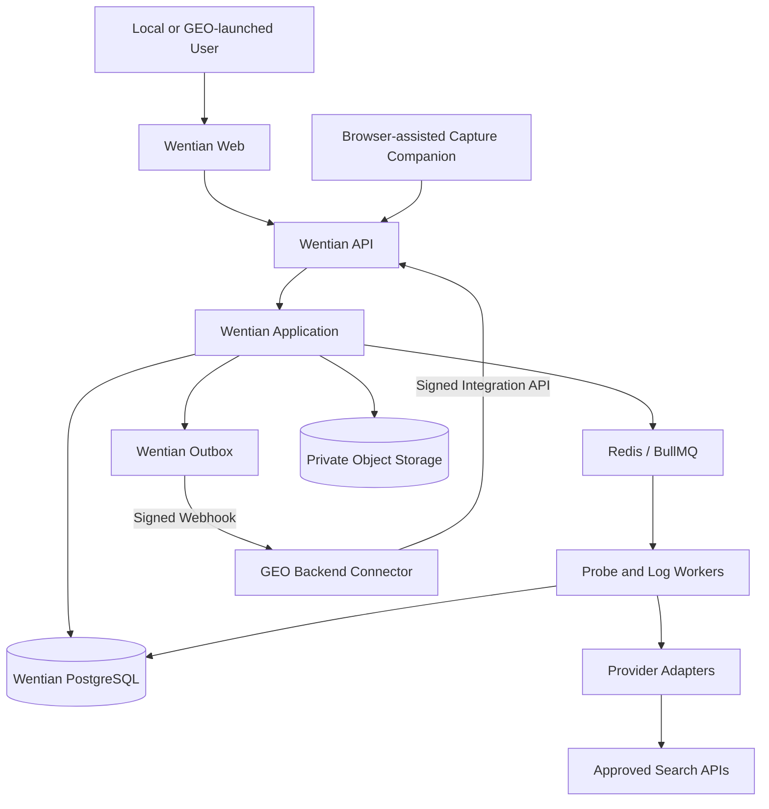

# “问天”AI信源探测系统技术设计

> 状态：已批准（`CHG-VIS-002`）  
> 原则：问天完整独立运行；GEO只能通过版本化连接器API接入

## 1. 架构决策

### 1.1 一个独立系统、一个GEO连接器

代码按以下边界组织：

```text
apps/api/
apps/web/
apps/worker/

packages/domain/          领域实体、状态和纯指标
packages/application/     用例和事务边界
packages/contracts/       业务API、Integration API与事件契约
packages/infrastructure/  PostgreSQL、队列、对象存储实现

packages/geo-connector-contracts/
  SSO、绑定、同步、Webhook Schema

GEO Content OS独立仓库
  navigation/status UI + backend connector client
```

以上目录都位于问天独立项目根目录。目录是建议边界，不要求为每一层创建独立发布包。核心约束是：问天domain/application不得导入GEO Repository、Router、权限Store或数据库模型；GEO连接器实现留在GEO Content OS独立仓库，只能依赖问天发布的连接器契约和HTTPS API。

系统与连接器边界：

| 组件 | 负责 | 不负责 |
|---|---|---|---|
| 问天 | 身份、项目、探测、指标、数据、用量、审计和完整UI | 不读取GEO数据库或会话 |
| GEO连接器 | 导航、一次性SSO、项目绑定、问题集同步、签名Webhook消费 | 不运行探测、Worker、迁移或Provider调用 |

问天MVP支持单组织、多项目，不提供公共多租户、自助计费或组织间数据共享。

### 1.2 运行模式保持分离

| 模式 | 执行目标 | 允许采集方式 | 含义 |
|---|---|---|---|
| `model_only` | `provider` | `provider_api` | 不启用搜索的API回答 |
| `search_api` | `provider` | `provider_api` | 具备结构化搜索/引用输出的正式API |
| `web_observed` | `consumer_surface` | `browser_assisted` 或 `manual_import` | 指定消费端网页的现场可见回答与引用 |
| `imported` | `external_dataset` | `manual_import` | 无法归属为现场消费端观察的历史或外部数据集 |

四种模式共享问题集，但不混合评分。原有品牌可见度分数继续只按其冻结方法计算；新信源指标由独立方法版本计算。

消费端人工粘贴仍写为 `web_observed + manual_import`，不能仅因录入方式为人工就写成 `imported`。历史或外部导入不能自动改判为 `web_observed`。

运行另有正交维度 `experiment_kind = natural_answer | source_nomination`。`source_nomination` 只测模型自述的信源提名；它可运行于API或消费端观察，但不得与自然回答写入同一运行。自述运行还必须固定 `nomination_context = unaided | search_assisted | surface_unknown`，不同上下文不得默认合并。

## 2. 总体架构



问天使用专用数据库、Redis和对象存储。GEO只通过网络API访问，不能获得基础设施凭证。GEO不可用时，问天本地登录、运行、报告和运维继续工作。

## 3. 组件职责

### 3.1 API层

- 从问天本地会话或已消费的GEO一次性票据建立 `WentianPrincipal`，校验项目scope和权限；
- 创建不可变运行配置快照；
- 使用问天本地用量账本预估并预留预算；
- 同事务写运行、问天usage record和问天Outbox；
- 提供运行、来源、问题和日志聚合查询；
- 不直接调用外部搜索提供商。

### 3.1A 核心领域与应用层

- 领域层实现运行状态、来源角色、证据等级、URL归一化和指标纯函数；
- 应用层编排运行、观察、日志和提名复核；
- 只依赖Persistence、Queue、Object Storage、Audit和Provider Ports；
- 所有业务实体使用问天项目 `scope_id` 隔离；GEO外部引用只存在于连接器表；
- 运行开始前保存不可变问题集快照，运行中GEO或连接器不可用不影响已排队样本读取。

### 3.1B GEO Integration API与连接器

Integration API只提供：

- 连接器实例认证与密钥轮换；
- GEO管理员发起、问天管理员选择本地项目并批准的显式绑定；
- 短期、一次性SSO launch code；
- 问题集快照同步；
- 绑定状态、健康状态和签名Webhook。

Integration API不得成为核心业务API的替代入口。连接器身份不能直接启动运行、读取原始回答或绕过问天项目权限，除非未来通过独立ADR新增明确的服务账号权限。

### 3.1C 问天Web与GEO入口页

问天Web包含完整页面、表格、图表、表单和证据抽屉，并负责登录、导航、项目切换和权限UI。

- GEO只新增轻量连接状态页和“进入问天”按钮；
- 点击后由GEO后端申请一次性launch code，再跳转问天Web；
- 不复制问天页面，不使用iframe或前端模块联邦；
- 问天页面不依赖GEO Router、Store或Cookie。

### 3.2 SearchProbeAdapter

统一输入：

```ts
interface SearchProbeRequest {
  requestId: string;
  queryText: string;
  locale: string;
  market?: string;
  approximateLocation?: {
    country?: string;
    region?: string;
    city?: string;
    timezone?: string;
  };
  searchContext: 'low' | 'medium' | 'high';
  maxOutputTokens: number;
}
```

统一输出：

```ts
interface SearchProbeResponse {
  providerRequestId: string | null;
  answerText: string;
  answerHash: string;
  candidates: readonly ProbeSource[];
  citations: readonly ProbeCitation[];
  usage: ProbeUsage;
  rawMetadata: Readonly<Record<string, unknown>>;
}
```

Adapter只负责：调用、超时、提供商错误归类、结构化字段解析。URL归一化、scope归属写入、重试语义和聚合由核心服务统一实现。

### 3.3 Probe Worker

每个运行按问题和样本循环：

1. 领取运行并验证状态；
2. 读取不可变问题集和运行快照；
3. 检查已有 `run + query + sample_index`，支持至少一次投递幂等；
4. 调用对应Adapter；
5. 先写不可变响应，再写来源事件；
6. 写问天本地usage ledger；
7. 更新运行进度；
8. 全部处理后按成功数形成终态。

单次技术重试必须复用同一业务幂等键，不能增加样本数。外部响应未知时记录失败，不猜测成功。

### 3.4 来源归一化服务

纯函数、版本化、无网络访问。输入原始URL，输出规范URL、host、registrable domain和诊断。禁止在请求链路中抓取第三方URL；这样可减少SSRF、条款和版权风险。

### 3.5 日志导入服务

MVP采用文件导入而非云账号直连：

- 上传文件先存私有对象存储；
- 预检只解析固定上限样本行；
- 确认后发异步任务；
- 流式解析，不把完整日志载入内存；
- 对IP做官方范围快照匹配；
- 原始IP按策略脱敏或哈希，不在分析接口回显；
- 只持久化必要请求字段和日聚合。

### 3.6 信源自述解析服务

- 使用版本化 `source_nomination` 提示词；
- API支持结构化输出时优先要求最多10条域名、顺序和适用信息类型；
- 消费端观察无法保证结构化输出时，先确定性提取HTTP(S) URL和显式域名，再由用户复核；
- 结构化校验通过的结果直接以 `nominated` 角色保存；不确定结果先写parse review暂存，人工确认后才创建事件，不转换为candidate或cited；
- 模型声称掌握内部抓取统计时保存原文并标记 `unsupported_internal_claim`，不将其数值写入指标。
- `nomination_context` 由服务端按运行快照派生：`model_only → unaided`，`search_api → search_assisted`；`web_observed` 页面明确关闭搜索时为 `unaided`，明确启用时为 `search_assisted`，无法确认时为 `surface_unknown`。客户端不得覆盖该值。

### 3.7 消费端观察服务

MVP包含两种采集方式：

- `browser_assisted`：用户在自己的已登录会话中主动执行问题和点击采集；
- `manual_import`：用户粘贴回答、引用并上传截图。

浏览器辅助采集器只读取当前页面可见的回答文本、可见引用链接、来源面板和页面元数据，生成脱敏观察包。它不得读取密码输入、Cookie、localStorage token、Authorization、隐藏网络响应或跨域不可见数据。观察包先在本地预览；用户丢弃误采内容时不得上传。

上传后的观察包进入 `needs_review`，用户在平台确认页确认后才变为 `confirmed` 并进入默认统计。确认状态与证据等级分开：浏览器辅助确认为 `web_confirmed_capture`，人工录入确认为 `web_confirmed_manual`；结构化API为 `api_structured + not_required`，外部数据集为 `imported_declared + not_required` 并默认排除。页面适配器签名变化、回答仍在生成、引用面板未加载或采集内容与截图不一致时失败关闭。用户拒绝已上传的观察包时，暂存证据按受控隐私清除流程删除，只保留任务拒绝原因和审计记录。

全自动登录、自动发送全部问题、验证码处理和无人值守批量采集不进入MVP。

## 4. 提供商能力模型

每个提供商配置一份版本化能力快照：

```text
provider_code
provider_model_id
supports_web_search
returns_candidates
returns_citations
returns_citation_positions
returns_search_queries
supports_location
allowed_retention_policy
terms_reviewed_at
enabled
```

运行创建时复制快照引用。能力发生变化只发布新版本，不反向修改历史运行。

消费端另使用版本化 `consumer_surface_profiles`，记录产品界面代码、允许采集方式、可见字段能力、页面适配器版本和条款复核状态，不与API Provider能力混用。

每个surface版本还可保存经审批的API比较映射：`comparison_surface_model_label`、`comparison_provider_code`、`comparison_model_key`、`equivalence_level = exact | approximate | unknown`、`equivalence_basis` 和复核时间。只有提供商公开证据支持时才能标为 `exact`；模型族映射只能标为 `approximate`；未配置或无法证明时为 `unknown`，指标层返回 `comparison_tier=query_only`。运行时页面显示模型还必须与映射中的surface标签匹配；未知或不匹配时降级为 `query_only`。不得从页面营销名称推断API model ID。

## 5. 状态与幂等

### 5.1 运行状态

沿用：

```text
queued -> running -> succeeded
                  -> partial
                  -> failed
queued/running -> cancelled
```

### 5.2 样本状态

响应表保持“成功有正文、失败有error”的互斥约束。建议新增外层状态只用于查询，不允许覆盖不可变响应。

### 5.2A 连接器投递状态

GEO Webhook投递状态与运行终态正交。回调失败只进入Outbox重试或死信告警，不回退运行、不重复Provider调用，也不影响问天报告可用性。

### 5.3 幂等键

- 创建运行：HTTP `Idempotency-Key + request_hash`；
- Outbox投递：`event.id`；
- Worker业务键：`scope_id + run_id + query_snapshot_item_id + sample_index`；
- 提供商请求ID：`visibility:<run_id>:<query_key>:<sample_index>`；
- 日志导入：`scope_id + owned_domain_id + file_sha256 + mapping_hash`。
- 消费端任务：`scope_id + observation_session_id + query_snapshot_item_id + sample_index`；
- 观察包：`capture_sha256 + screenshot_sha256 + visible_answer_hash`，重复提交不得生成新样本。

## 6. 一致性与事务

- API创建运行、问天用量预留记录和Outbox写入同一事务；GEO回调在事务提交后异步发送。
- 成功样本的响应、来源事件和用量记录需在一个数据库事务中落盘。
- 汇总可重算，原始响应和来源事件不可覆盖。
- Redis只承载队列和短期缓存，不承载唯一事实。
- 聚合缓存键包含system instance、scope、methodology和筛选哈希。

## 7. 错误分类

新增或复用：

| 错误码 | HTTP/Worker语义 | 是否重试 |
|---|---|---|
| `PRINCIPAL_INVALID` | 问天会话不可验证 | 否 |
| `PROJECT_SCOPE_UNAVAILABLE` | 项目不存在、停用或无权限 | 否 |
| `GEO_CONNECTOR_UNAUTHORIZED` | GEO连接器认证或签名失败 | 否 |
| `GEO_BINDING_UNAVAILABLE` | GEO项目未绑定或已断开 | 否 |
| `GEO_SSO_TICKET_INVALID` | SSO票据过期、重放或上下文不匹配 | 否 |
| `PROBE_PROVIDER_NOT_ENABLED` | 提供商未启用 | 否 |
| `PROBE_CAPABILITY_UNAVAILABLE` | 不返回所需引用能力 | 否 |
| `PROBE_PROVIDER_RATE_LIMITED` | 提供商限流 | 按Retry-After有界重试 |
| `PROBE_PROVIDER_TIMEOUT` | 请求超时 | 有界重试 |
| `PROBE_RESPONSE_INVALID` | 返回结构不满足契约 | 一次修复性重取后失败 |
| `PROBE_BUDGET_EXCEEDED` | 预算不足 | 否 |
| `LOG_FORMAT_INVALID` | 日志字段映射错误 | 否 |
| `LOG_DOMAIN_OUT_OF_SCOPE` | URL不属于授权域名 | 否 |
| `CRAWLER_IDENTITY_UNVERIFIED` | 仅UA或IP不匹配 | 不进入默认统计 |
| `OBSERVATION_CAPTURE_INVALID` | 可见回答、引用或截图不完整 | 重采，不自动修补 |
| `OBSERVATION_SURFACE_CHANGED` | 页面签名或适配器失配 | 否，暂停该surface |
| `OBSERVATION_CONFIRMATION_REQUIRED` | 尚未人工确认 | 不进入默认统计 |
| `NOMINATION_PARSE_REVIEW_REQUIRED` | 自述域名解析不确定 | 转人工复核 |

错误日志只保存脱敏原因、HTTP状态、提供商请求ID和响应结构摘要，不保存密钥或完整响应正文。

## 8. 性能和容量

MVP容量假设：

- 单次运行最多100题 × 5样本 = 500个外部请求；
- 同一scope并发运行数默认1；
- 单提供商并发由配置控制，默认2；
- 单日志文件上限建议500 MiB，最终值需由安全评审确认；
- 原始回答按scope所属组织的保留期保存，来源聚合可更长时间保存；
- 查询接口默认cursor分页，来源排行榜最大返回100项。
- 单个消费端观察任务由用户逐样本确认；MVP不提供后台无人值守吞吐承诺。

API同步请求P95继续遵守800ms目标；外部探测全部异步，不纳入同步P95。

## 9. 可观测性

核心链路字段：`request_id`、`system_instance_id`、`scope_id`、`run_id`、`query_snapshot_item_id`、`sample_index`、`provider_code`。连接器链路另带 `connector_instance_id` 和 `binding_id`；GEO租户/工作区/项目外部引用不得作为公开监控标签。

指标：

- 运行队列等待时长；
- 样本成功/失败/超时/限流；
- 提供商调用时延和成本；
- 每个运行完成比例；
- URL归一化失败数；
- 日志预检/导入行数与失败数；
- 官方IP范围快照更新时间。
- 消费端观察任务等待、采集、确认和拒绝数量；
- consumer surface适配器签名失败；
- 自述提名解析与人工复核数量。

不得把问题原文、回答正文、URL查询参数、IP或API密钥作为高基数监控标签。

## 10. 安全边界

- 提供商密钥只来自环境变量或密钥服务。
- 问天本地会话或已消费的SSO launch code才能生成 `WentianPrincipal`；核心API不接受客户端自行构造principal或scope成员关系。
- GEO连接器服务端请求必须验证签名、issuer、audience、nonce、时间窗、幂等键和连接器状态。
- GEO身份映射与项目访问映射分开；同一外部用户在不同project binding的角色、版本和撤销状态不得共用。
- 日志上传执行MIME、大小、压缩炸弹和恶意文件检查。
- 解析器不执行日志内容，不渲染HTML。
- 不主动访问第三方引用URL。
- 浏览器辅助采集器不读取凭证、Cookie、Token、隐藏请求或非当前可见页面内容。
- 消费端截图和可见DOM片段属于私有证据对象，使用system instance/scope路径、短期签名URL和保留期。
- 原始回答和日志对象使用system instance/scope路径与服务端签名URL。
- 所有写操作要求CSRF、幂等键和权限校验。
- 项目scope外键、Repository scope、项目级访问版本、成员关系与连接器越权测试共同保证隔离。

## 11. 兼容现有实现

- GEO现有 `ai_visibility_query_sets`、`ai_visibility_queries` 和历史运行保持不变；连接器只通过GEO现有服务读取获授权问题集并调用问天同步API；
- 新信源运行只写问天数据库，不向GEO旧表添加字段；
- GEO现有 `model_only` 历史报告继续按冻结方法展示，不与问天报告进行数据库级联表；
- `web_observed`、`experiment_kind`、多样本和来源事件只在问天契约中新增；
- `imported` 保留给历史或外部数据集，现有导入记录不自动转换；
- 原有评分 `ai-visibility-score@2` 不吸收新信源指标，避免历史分数漂移；
- 问天不承诺读取GEO历史运行；需要迁移时必须通过显式导出/导入任务和独立ADR。

## 12. 待决技术项

开发前必须明确：

1. 首批生产提供商及账号区域；
2. 原始回答、候选和引用的允许保留期；
3. OpenAI搜索返回中需要持久化的字段白名单；
4. Perplexity条款下的允许分析与导出范围；
5. 官方爬虫IP范围快照的更新频率和失败回退；
6. 日志文件上限与保留期；
7. 是否在MVP后提供通用外部数据集导入UI；消费端现场 `manual_import` 已属于MVP范围。
8. 首批消费端产品、允许的浏览器辅助范围及页面适配器维护责任人；
9. 截图和可见DOM片段的保留期；
10. 信源自述的结构化提示词与人工复核阈值。
11. 问天部署编排、备份介质和支持责任人；
12. GEO连接器首发范围、回调事件和运维责任人；
13. 本地身份实现、初始管理员初始化方式及GEO角色映射；
14. SSO launch code有效期、签名算法和连接器密钥轮换周期。
