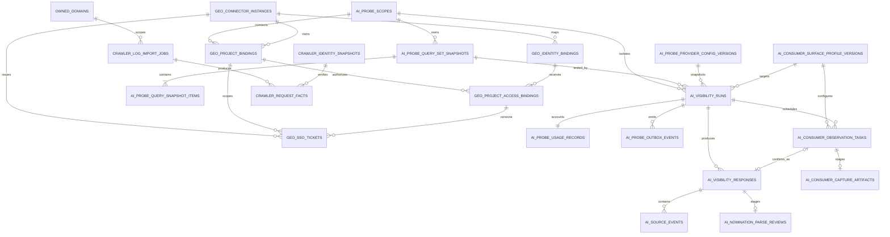

# “问天”AI信源探测系统数据模型与API契约

> 状态：已批准设计基线（`CHG-VIS-002`）。本文不是已发布API；正式开发必须先更新 `packages/contracts`，再生成OpenAPI。

## 1. 数据设计原则

- 历史问题、响应和来源事件不可覆盖；
- 原始证据与归一化聚合分开；
- 搜索候选与最终引用分开；
- 提供商返回能力缺失用 `not_available` 表示，不用空数组伪装；
- 所有业务表属于问天数据库，并通过项目 `scope_id` 隔离；
- GEO租户、工作区、项目和用户引用只存在于连接器表，不作为问天核心授权字段；
- 问天迁移只在问天数据库执行，不依赖或修改GEO schema；
- GEO连接器只能调用问天Integration API，不能直连数据库；
- 汇总可重算，原始事实只追加；
- URL归一化版本必须可追溯。

## 2. 问天核心表

### 2.1 `ai_visibility_runs`

逻辑名称保持兼容，但新信源运行只写入问天数据库，不扩展GEO历史表。`id/status/retrieval_mode/engine_code/model_key/created_at/updated_at/version` 等通用运行字段由问天表自有，不引用GEO运行记录；同时必须包含：

| 字段 | 类型 | 说明 |
|---|---|---|
| `scope_id` | uuid | 问天项目授权与数据隔离单位 |
| `query_set_snapshot_id` | uuid | 问天拥有的不可变问题集快照 |
| `execution_target_type` | varchar(24) | `provider | consumer_surface | external_dataset` |
| `provider_config_version_id` | uuid nullable | API运行时提供商能力快照 |
| `experiment_kind` | varchar(24) | `natural_answer | source_nomination` |
| `nomination_context` | varchar(24) nullable | `unaided | search_assisted | surface_unknown`；仅自述运行必填，由服务端派生 |
| `collection_method` | varchar(24) | `provider_api | browser_assisted | manual_import` |
| `consumer_surface_profile_version_id` | uuid nullable | 消费端产品界面能力快照 |
| `paired_run_id` | uuid nullable | 用于自述—自然回答或API—消费端对照 |
| `requested_sample_count` | smallint | 每题计划样本数，MVP 1–5 |
| `successful_sample_count` | integer | 成功样本总数 |
| `failed_sample_count` | integer | 失败样本总数 |
| `locale` | varchar(16) | 冻结语言 |
| `market` | varchar(120) nullable | 冻结市场 |
| `location_json` | jsonb nullable | 允许的近似位置，不含精确坐标 |
| `search_context` | varchar(16) nullable | low/medium/high |
| `normalization_version` | varchar(64) | URL归一化版本 |
| `source_methodology_version` | varchar(64) nullable | 信源指标方法版本 |

约束：`query_count × requested_sample_count = 计划样本总数`；进度使用样本总数，不再只按问题数。

固定组合约束：

| `retrieval_mode` | `execution_target_type` | `collection_method` |
|---|---|---|
| `model_only` | `provider` | `provider_api` |
| `search_api` | `provider` | `provider_api` |
| `web_observed` | `consumer_surface` | `browser_assisted` 或 `manual_import` |
| `imported` | `external_dataset` | `manual_import` |

`search_api/model_only` 要求Provider/模型字段完整；`web_observed` 要求surface快照完整。`engine_code`、`model_key` 对消费端和外部数据集运行允许为空，页面实际显示的模型标签保存于观察元数据，不能伪造成API model ID。消费端人工录入仍使用 `web_observed + manual_import`；历史或外部数据集使用 `imported + manual_import`，不得相互自动转换。

`nomination_context` 派生约束：`model_only + source_nomination → unaided`，`search_api + source_nomination → search_assisted`；`web_observed + source_nomination` 在surface明确关闭搜索时为 `unaided`、明确启用时为 `search_assisted`，无法确认时为 `surface_unknown`。`natural_answer` 必须为空。

### 2.2 `ai_visibility_responses`

问天响应表自有answer/error/hash/sample等通用响应字段。响应必须通过 `scope_id + run_id` 复合外键归属问天运行，并包含：

| 字段 | 类型 | 说明 |
|---|---|---|
| `scope_id` | uuid | 与运行一致的问天项目scope |
| `query_snapshot_item_id` | uuid | 问天问题快照项；不得引用GEO问题表 |
| `provider_raw_metadata_json` | jsonb nullable | 字段白名单后的提供商元数据 |
| `candidate_data_available` | boolean | 提供商是否提供候选列表 |
| `citation_data_available` | boolean | 提供商是否提供引用列表 |
| `source_granularity` | varchar(16) | answer/span/claim/none |
| `verification_status` | varchar(24) | `not_required | needs_review | confirmed | rejected`；描述是否需要及是否通过人工确认 |
| `evidence_grade` | varchar(32) nullable | `api_structured | web_confirmed_capture | web_confirmed_manual | imported_declared`；描述成功证据产生方式 |
| `unsupported_internal_claim` | boolean | 是否声称掌握不可核验的内部抓取统计 |

现有 `citations_json` 继续保存兼容快照，不作为复杂聚合的唯一来源。

成功响应必须满足：API为 `not_required + api_structured`，已确认消费端观察为 `confirmed + web_confirmed_capture/web_confirmed_manual`，外部数据集为 `not_required + imported_declared`。失败响应的 `evidence_grade` 必须为空，不能为失败样本伪造证据等级。

## 3. 新增表

### 3.1 `ai_probe_scopes`

问天的授权、隔离和生命周期单位：

```text
id, project_key, display_name, status,
retention_policy_code, created_by, created_at, updated_at, version
```

问天MVP中一个scope对应一个本地项目。核心Repository的所有业务查询必须从服务端principal取得允许的 `scope_id`；客户端传入的scope只用于选择，不能证明权限。

### 3.2 `geo_connector_instances`

保存经问天管理员批准的GEO连接实例：

```text
id, geo_instance_ref, geo_tenant_ref, display_name, allowed_origins_json,
callback_base_url, credential_key_id, contract_version,
status, last_seen_at, created_by, created_at, updated_at, version
```

`status = active | suspended | revoked`。MVP一个问天实例只允许一个active连接器实例，并固定一个 `geo_tenant_ref`。密钥明文不入表；`credential_key_id` 指向密钥服务或加密材料。连接器状态只控制SSO、同步和回调，不影响问天本地登录或核心运行。

### 3.2A `geo_project_bindings`

```text
id, connector_instance_id, scope_id nullable,
geo_workspace_ref, geo_project_ref,
status, requested_by_geo_user_ref, requested_at,
reviewed_by, reviewed_at, rejection_reason,
last_query_sync_at, disconnected_at,
created_at, updated_at, version
```

`status = pending_wentian | active | suspended | rejected | disconnected`。GEO管理员通过签名请求发起后进入 `pending_wentian`，此时 `scope_id` 为空且禁止SSO和同步；问天管理员必须在问天内选择一个本地scope并批准，之后才进入 `active`。对 `pending_wentian | active | suspended` 建立 `connector_instance_id + geo_project_ref` 部分唯一约束；`rejected/disconnected` 记录永久保留引用关系，重新申请必须创建新binding ID。一个active binding只对应一个问天scope。不能按名称自动匹配，也不能由任一端单方直接创建active binding。解绑只撤销该binding的项目访问和会话，不删除scope、历史事实或同连接器下其他项目绑定。

### 3.2B `geo_identity_bindings`

```text
id, connector_instance_id, geo_user_ref, wentian_user_id,
status, created_at, updated_at, version
```

唯一键为 `connector_instance_id + geo_user_ref`。不得用邮箱或手机号作为唯一映射键。该表只负责外部身份与问天用户的稳定映射，不保存项目角色。

### 3.2C `geo_project_access_bindings`

保存同一GEO用户在不同项目下相互独立的访问映射：

```text
id, project_binding_id, identity_binding_id,
geo_role_codes_json, wentian_role_code, status,
access_version, last_sso_at, created_at, updated_at
```

唯一键为 `project_binding_id + identity_binding_id`；`status = active | revoked`。每次角色更新或撤销都递增 `access_version`，并同步更新问天本地项目成员关系。不同project binding不得复用角色状态；问天项目成员关系仍是最终授权事实。

### 3.2D `geo_sso_tickets`

保存短期一次性SSO票据的哈希与消费状态：

```text
id, connector_instance_id, project_binding_id,
identity_binding_id, project_access_binding_id, access_version,
geo_user_ref,
code_hash, role_codes_json, requested_path, nonce, request_id,
status, expires_at, consumed_at, created_at
```

`status = issued | consumed | expired | revoked`。code明文只在签发响应中返回一次；`code_hash` 唯一。消费必须使用原子条件更新，防止并发重放。过期票据可按短保留期清理，但安全审计保留request ID、结果和时间。

### 3.3 `ai_probe_query_set_snapshots`

运行所需问题集的问天不可变快照：

```text
id, scope_id, source_type, source_ref, source_revision,
source_geo_binding_id, source_contract_version,
snapshot_json, snapshot_hash,
query_count, created_by, created_at
```

`source_type = local | geo_sync | imported`。`geo_sync` 必须引用active或已断开的历史binding，并冻结同步时的 `source_contract_version`；相同 `scope_id + snapshot_hash` 幂等复用。运行只读取问天快照，不在执行期间回调GEO。

### 3.3A `ai_probe_query_snapshot_items`

保存快照内可被响应、来源事件和观察任务稳定引用的问题项：

```text
id, scope_id, query_set_snapshot_id, ordinal, external_key,
query_text, intent, commercial_value, item_hash, created_at
```

快照项与快照一起创建后不可更新或删除；`scope_id + query_set_snapshot_id + ordinal` 唯一。`external_key` 只用于追溯本地或GEO来源，不作为授权键。问天运行与Worker使用 `query_snapshot_item_id`，不得引用GEO `ai_visibility_queries`。

### 3.4 `ai_probe_provider_config_versions`

平台级、不可覆盖的提供商能力配置；不保存API密钥。

关键字段：

```text
id, provider_code, provider_model_id, adapter_key,
supports_candidates, supports_citations, supports_citation_positions,
supports_location, retention_policy_code, terms_reviewed_at,
status, version, created_by, created_at
```

同一 `provider_code + provider_model_id` 只允许一个 `published` 版本。

### 3.5 `ai_source_events`

每条候选或引用一个不可变事件。

```text
id
scope_id
run_id
response_id
query_snapshot_item_id
sample_index
role                 candidate | cited | nominated
source_position      nullable positive integer
original_url
normalized_url
url_hash             nullable; only when normalized_url exists
source_key_hash      normalized_url hash, or registrable_domain hash when URL is absent
host
registrable_domain
title                 nullable
snippet               nullable, only if provider terms permit
mapping_granularity   answer | span | claim | none
answer_start          nullable
answer_end            nullable
provider_source_id    nullable
nomination_information_type nullable; nominated only
nomination_reason     nullable; nominated only
nomination_validation_method nullable; schema_validated | human_confirmed, nominated only
normalization_version
created_at
```

唯一约束建议（PostgreSQL 16）：

```text
UNIQUE NULLS NOT DISTINCT
(scope_id, response_id, role, source_key_hash, source_position)
```

使用 `NULLS NOT DISTINCT`，避免 `source_position` 为空时重复事件绕过唯一约束。

同一URL同时作为候选和引用时保存两条不同角色事件。

自述实验中的域名使用 `nominated`；没有完整URL时允许 `original_url`、`normalized_url` 和 `url_hash` 为空，但必须保存规范化域名、基于域名计算的 `source_key_hash`、提名顺序和 `nomination_validation_method`。不得为补齐字段伪造URL。

`source_key_hash` 必填并由服务端按 `normalized_url` 优先、否则按 `registrable_domain` 计算；哈希输入必须包含键类型和归一化版本，避免URL键与域名键碰撞。客户端不得提交该字段。

### 3.6 `owned_domains`

问天自有授权域名表：

```text
id, scope_id, domain,
include_subdomains, verification_method, verification_status,
verified_at, created_by, created_at, updated_at, version
```

只有 `verified` 域名可用于“自有域名引用率”和爬虫日志默认统计。

### 3.7 `crawler_log_import_jobs`

```text
id, scope_id, owned_domain_id,
object_key, file_sha256, file_size, format_code, mapping_json,
status, total_rows, accepted_rows, rejected_rows, duplicate_rows,
verified_rows, ua_only_rows, started_at, finished_at,
error_json, requested_by, version, created_at, updated_at
```

状态：`preflight | ready | queued | processing | succeeded | partial | failed | cancelled`。

### 3.8 `crawler_request_facts`

首期建议保存最小事实，不保存完整原始日志：

```text
id, scope_id, import_job_id,
owned_domain_id, observed_at, bot_code, identity_snapshot_id, verification_level,
method, normalized_url, url_hash, status_code, response_bytes,
ip_prefix_hash, user_agent_family, created_at
```

对大规模scope可在后续改为日分区或只保存日聚合；MVP先限制导入规模并保留可审计事实。

### 3.9 `crawler_identity_snapshots`

保存官方IP范围和UA规则快照：

```text
id, bot_code, source_url, source_sha256, ip_ranges_json,
ua_rules_json, fetched_at, valid_from, status, error_json
```

官方列表拉取失败时使用最近有效快照并在UI标记陈旧时间，不静默认定新IP。

### 3.10 `ai_consumer_surface_profile_versions`

平台级、版本化、不可覆盖的消费端页面能力配置，不保存用户账号或凭证：

```text
id, surface_code, product_label, adapter_version,
allowed_collection_methods_json, visible_source_capabilities_json,
comparison_surface_model_label, comparison_provider_code, comparison_model_key,
equivalence_level, equivalence_basis, equivalence_evidence_url,
equivalence_reviewed_at, terms_reviewed_at, status, created_by, created_at
```

`equivalence_level = exact | approximate | unknown`。`exact` 必须有提供商公开证据支持同一模型或快照；`approximate` 只表示经审批的模型族映射；缺少证据时为 `unknown`。每次映射变化发布新surface版本，不修改历史记录。计算对照时，观察包中的页面显示模型必须与 `comparison_surface_model_label` 匹配；未知或不匹配时强制返回 `query_only`。

### 3.11 `ai_consumer_observation_tasks`

一个任务对应一个消费端运行中的一个问题样本：

```text
id, scope_id, run_id, query_snapshot_item_id, sample_index,
surface_profile_version_id, status, one_time_capture_token_hash,
token_expires_at, assigned_to, capture_artifact_id, confirmed_response_id,
captured_at, confirmed_at, rejected_at,
version, created_at, updated_at
```

状态：`waiting_user | capturing | needs_review | confirmed | rejected | expired | cancelled`。

`capture_artifact_id` 在拒绝清除时使用 `ON DELETE SET NULL`；`confirmed_response_id` 只在confirmed终态存在，并必须与任务的scope/run/query/sample一致。

### 3.12 `ai_consumer_capture_artifacts`

保存待确认的可见证据包；同一任务至多一个：

```text
id, scope_id, observation_task_id, answer_text, answer_hash,
visible_citations_json, visible_metadata_json, screenshot_media_asset_id,
sanitized_dom_object_key, dom_hash, capture_sha256, adapter_version,
collection_method, captured_by, created_at
```

`observation_task_id` 建立唯一约束。证据内容不允许普通UPDATE；用户拒绝后，由scope范围内的隐私清除服务删除暂存对象和artifact行，并保留任务拒绝原因与审计事件。确认后，任务写入 `confirmed_response_id`，正式response和source events继续保持append-only。

`visible_metadata_json` 只允许产品界面、页面显示模型、搜索模式、新会话、登录、记忆/个性化、语言、地区和观察时间等白名单字段。Cookie、localStorage、Authorization和账号标识不得进入观察包。

### 3.13 `ai_nomination_parse_reviews`

消费端文本或非结构化API回答的确定性提取暂存，不直接进入指标：

```text
id, scope_id, response_id,
proposed_items_json, status, reviewed_by, reviewed_at, rejection_reason,
version, created_at, updated_at
```

`response_id` 唯一，状态为 `needs_review | confirmed | rejected`。`proposed_items_json` 只保存最多10个显式提取的域名、顺序、信息类型和理由。确认事务创建正式 `nominated` source events；拒绝不创建事件。已确认/拒绝记录进入终态，不原地改回needs_review。

### 3.14 `ai_probe_usage_records`

问天用量预留和实际用量的唯一事实：

```text
id, scope_id, run_id, reservation_key,
estimate_json, reserved_json, actual_json,
usage_status, created_at, updated_at, version
```

每个运行一个记录。`usage_status = estimated | reserved | committed | released`。问天本地预算是能否启动外部调用的唯一门禁，不依赖GEO成本账本。

### 3.15 `ai_probe_outbox_events`

问天事务发布内部任务和可选集成事件的Outbox：

```text
id, scope_id, connector_instance_id, project_binding_id,
event_name, event_version,
aggregate_type, aggregate_id, payload_json,
status, attempt_count, next_attempt_at, published_at,
last_error_json, created_at
```

Outbox只携带契约允许的对象ID、scope和必要状态，不携带回答正文、日志原文、Cookie、密钥或签名URL。对GEO的事件由独立Webhook投递器按binding映射发送。

## 4. 关系概览



## 5. API 设计

Base URL使用 `/api/v1`。问天只有一个业务OpenAPI和一个独立运行入口；GEO连接器使用隔离的Integration API分组。以下为已批准的设计输入，实现以生成后的OpenAPI为准。

### 5.0 项目与问题集快照

- `GET /wentian/scopes`
- `POST /wentian/query-set-snapshots`

scopes只返回当前principal可访问项目。普通创建快照只接受本地编辑器输入；GEO同步必须走连接器专用端点。客户端不能提交scope成员关系或GEO外部归属。

### 5.1 运行预估

`POST /ai-visibility/runs/estimate`

用途：提交前计算计划请求数、启用能力和预算估计，不创建运行。

请求：

```json
{
  "scope_id": "uuid",
  "query_set_snapshot_id": "uuid",
  "provider_codes": ["openai_search", "perplexity_sonar"],
  "experiment_kind": "natural_answer",
  "sample_count": 3,
  "search_context": "medium",
  "location": { "country": "CN", "region": "Guangdong", "city": "Guangzhou" }
}
```

返回：

```json
{
  "schema_version": "ai-probe-run-estimate@1",
  "query_count": 30,
  "provider_count": 2,
  "sample_count": 3,
  "planned_request_count": 180,
  "estimated_cost_cents": 0,
  "cost_is_estimate": true,
  "capability_warnings": []
}
```

如无法从当前费率卡计算费用，`estimated_cost_cents` 为 `null`，不得返回0冒充免费。

### 5.2 创建运行

扩展 `POST /ai-visibility/runs`：

```json
{
  "scope_id": "uuid",
  "query_set_snapshot_id": "uuid",
  "provider_codes": ["openai_search", "perplexity_sonar"],
  "retrieval_mode": "search_api",
  "experiment_kind": "natural_answer",
  "collection_method": "provider_api",
  "sample_count": 3,
  "search_context": "medium",
  "location": { "country": "CN", "region": "Guangdong", "city": "Guangzhou" },
  "baseline_run_ids": {}
}
```

为每个提供商创建一个运行，返回数组。写操作要求CSRF和Idempotency-Key。

`source_nomination` 运行必须单独创建，可选提供 `paired_run_id` 指向同范围的 `natural_answer` 运行。客户端不提交 `nomination_context`；服务端从检索模式和surface搜索状态派生并冻结。自然回答字段保持为空，对照时服务端按同一规则派生其有效搜索上下文。服务端验证问题集、Provider/surface、位置、样本数、方法版本和有效上下文是否可比。

### 5.3 运行详情

扩展 `GET /ai-visibility/runs/{id}`：

- 返回运行快照、样本进度、方法版本；
- 响应列表按问题和sample_index组织；
- 默认不内联全部来源事件和完整原始元数据，避免超大响应。

### 5.4 运行来源

`GET /ai-visibility/runs/{id}/sources`

查询：`role`、`domain`、`intent`、`commercial_value`、`cursor`、`limit`。

返回来源聚合及可下钻事件ID，包含每个比例的分子和分母。

### 5.5 来源趋势

`GET /ai-visibility/source-trends`

必填：`scope_id`、`query_set_snapshot_id`、时间范围。跨快照趋势只有在snapshot hash等价时才能并列比较。

可选：provider、domain、role、intent。不同配置的运行默认不连成一条趋势线。

### 5.6 来源详情

`GET /ai-visibility/sources/{domain}`

域名参数必须规范化和编码；查询必须先验证principal允许的scope。返回域名聚合、URL列表、问题覆盖和证据引用。

### 5.7 日志预检

`POST /crawler-log-imports/preflight`

multipart上传，要求：scope_id、owned_domain_id、format_hint。返回字段映射、样本预览和错误统计，不写请求事实。

### 5.8 确认日志导入

`POST /crawler-log-imports/{id}/commit`

请求包含确认后的mapping和preflight版本。创建异步任务并写Outbox。

### 5.9 日志任务

`GET /crawler-log-imports/{id}`

返回进度、验证级别计数、错误分类和对象保留到期时间。

### 5.10 爬虫趋势

`GET /crawler-metrics/trend`

必填：scope_id、owned_domain_id、时间范围。默认只统计 `verified`；请求 `ua_only` 需要显式参数并在响应带警告。

### 5.11 创建消费端观察运行

`POST /ai-visibility/consumer-observations`

请求包含：scope_id、query_set_snapshot_id、surface_code、`collection_method=browser_assisted|manual_import`、experiment_kind、sample_count、会话条件和可选paired_run_id。服务端校验该方式在surface版本允许范围内，返回一个 `web_observed` 运行和逐题观察任务，不发起外部网页操作。

### 5.12 领取观察任务

`POST /ai-visibility/consumer-observations/tasks/{id}/claim`

返回标准问题、采集条件和短期一次性capture token。Token只允许提交该任务的观察包，不包含消费端账号信息。

### 5.13 提交观察包

`POST /ai-visibility/consumer-observations/tasks/{id}/captures`

multipart提交白名单元数据、可见回答、可见引用、截图和可选脱敏DOM片段。提交后任务进入 `needs_review`，不直接进入指标。

### 5.14 确认或拒绝观察

- `POST /ai-visibility/consumer-observations/tasks/{id}/confirm`
- `POST /ai-visibility/consumer-observations/tasks/{id}/reject`

确认时由服务端写不可变response和source events，并按采集方式写入 `web_confirmed_capture` 或 `web_confirmed_manual`。拒绝时任务进入终态、暂存证据通过受控隐私清除服务删除，只保留拒绝原因和审计事件；该样本不进入默认统计。两个动作要求任务version和Idempotency-Key。

### 5.15 信源自述对照

`GET /ai-visibility/nomination-comparisons`

返回提名率、首位提名率、提名稳定度、提名—引用Top-K重合及两组独立分母。不满足可比条件时返回 `not_comparable` 和原因。

### 5.16 API—消费端对照

`GET /ai-visibility/consumer-comparisons`

服务端从运行引用的surface版本读取模型等价映射，并返回：

- `comparison_tier = exact | approximate | query_only`；
- `model_equivalence_version` 和证据摘要；
- 两组独立样本基数、Top-K集合和警告。

`exact` 和 `approximate` 可返回重合度；`query_only` 只返回同题并列集合，不返回模型一致性数值。未配置映射或模型未知时必须为 `query_only`。

### 5.17 信源提名解析复核

- `GET /ai-visibility/nomination-reviews?status=needs_review`
- `POST /ai-visibility/nomination-reviews/{id}/confirm`
- `POST /ai-visibility/nomination-reviews/{id}/reject`

确认请求提交复核后的最多10个显式域名、顺序、信息类型和理由。服务端重新规范化域名，并在同一事务中写正式 `nominated` 事件和终态review；不得由客户端提交URL哈希或scope归属字段。拒绝只写原因，不创建来源事件。

### 5.18 GEO连接器Integration API

问天管理员接口：

- `POST /integrations/geo/connector-instances`
- `POST /integrations/geo/connector-instances/{id}/rotate-secret`
- `POST /integrations/geo/connector-instances/{id}/suspend`
- `POST /integrations/geo/connector-instances/{id}/revoke`
- `GET /integrations/geo/project-binding-requests?status=pending_wentian`
- `POST /integrations/geo/project-binding-requests/{id}/approve`
- `POST /integrations/geo/project-binding-requests/{id}/reject`
- `PATCH /integrations/geo/project-bindings/{id}`
- `DELETE /integrations/geo/project-bindings/{id}`

GEO后端连接器接口：

- `GET /integrations/geo/status`
- `POST /integrations/geo/project-binding-requests`
- `DELETE /integrations/geo/project-binding-requests/{id}`
- `POST /integrations/geo/sso-tickets`
- `PUT /integrations/geo/project-bindings/{id}/query-set-snapshots`

浏览器使用 `GET /connect/geo?code=<one-time-code>` 消费票据并建立问天第一方会话。连接器接口使用与普通用户API隔离的认证中间件、速率限制和审计类型，不接受浏览器Cookie认证。

所有连接器写接口要求 `X-Request-Id`、`Idempotency-Key`、时间戳、nonce、契约版本和签名。票据签发只返回一次code、过期时间和允许的问天跳转地址；不得返回问天session token或用户数据。

绑定申请只提交GEO租户内的工作区、项目引用和显示名，不允许GEO指定或枚举 `scope_id`。批准接口由问天管理员提交目标 `scope_id` 和当前binding `version`；GEO只可撤回仍为 `pending_wentian` 的本项目申请。批准、拒绝、撤回、暂停、解绑都必须审计。`pending_wentian`、`rejected`、`suspended` 和 `disconnected` 状态不得签发SSO票据或接收问题集同步。

票据签发前，问天按 `project_binding_id + identity_binding_id` 更新项目级访问映射和本地项目成员关系，并把当前 `access_version` 冻结到票据及会话。全局身份映射不得保存或复用项目角色。

GEO同步生成的快照必须保存请求中的契约版本；指标响应的 `geo_connector_contract_version` 从快照读取，不得从当前连接器实例反查。

## 6. 响应公共结构

所有信源指标响应包含：

```json
{
  "methodology_version": "ai-source-observatory@1",
  "normalization_version": "url-normalization@1",
  "experiment_kind": "natural_answer",
  "collection_method": "provider_api",
  "nomination_context": null,
  "evidence_grades": ["api_structured"],
  "comparison_tier": null,
  "model_equivalence_version": null,
  "computed_at": "2026-08-21T00:00:00.000Z",
  "sample_basis": {
    "planned": 90,
    "successful": 87,
    "failed": 3
  },
  "warnings": []
}
```

运行创建与详情响应返回问天本地 `usage_status`；GEO Webhook投递状态只在连接器状态接口展示，不进入指标公共结构。

## 7. 事件契约

### 7.1 探测请求

问天内部发布 `wentian.probe_requested.v1`。如发生不兼容字段变化则发布v2，不原地改变消费者假设。

事件数据最小字段：

```json
{
  "ai_visibility_run_id": "uuid",
  "scope_id": "uuid",
  "provider_code": "openai_search",
  "provider_config_version_id": "uuid",
  "source": "local_or_geo_sync"
}
```

### 7.2 日志导入请求

新增 `wentian.crawler_log_import_requested.v1`：

```json
{
  "crawler_log_import_job_id": "uuid",
  "owned_domain_id": "uuid",
  "scope_id": "uuid"
}
```

事件不携带对象存储凭证、完整路径签名或日志内容。

消费端观察由用户交互驱动，不通过后台事件自动操作第三方网页。确认观察后可发布内部事件 `wentian.consumer_observation_confirmed.v1` 触发聚合刷新，但事件只携带任务ID和scope ID。需要回传GEO时，由Webhook投递器生成连接器契约事件。

## 8. 数据保留与删除

- 原始回答：按scope所属组织策略，建议默认180天；
- 来源事件：按条款允许范围和scope策略；
- 原始日志对象：建议默认30天；
- 已确认消费端截图和脱敏DOM片段：建议默认90天；被拒绝的暂存证据按受控隐私清除流程立即删除；
- 最小请求事实：建议默认180天；
- 日聚合：可长期保留，但仍属于scope所属组织数据；
- 问天项目导出与删除必须覆盖业务表和对象存储路径；GEO解绑不触发数据删除。

最终期限必须通过法务、安全和提供商条款复核，本文数值只是产品建议。

## 9. 迁移要求

- 问天迁移使用独立序列和schema版本，不修改GEO历史迁移；
- 迁移必须通过问天空数据库安装与逐版本升级；
- 新表建立scope复合外键、索引和append-only触发器，不建立指向GEO业务表的外键；
- GEO现有运行不自动回填到问天数据库；
- 如未来迁移GEO历史数据，必须显式创建scope和问题集快照，保留来源系统与哈希，不推断source role、nomination context或web observation；
- GEO binding变化不重写历史运行或问题集快照；
- 问天升级必须支持备份恢复验证，且不需要访问GEO数据库。
