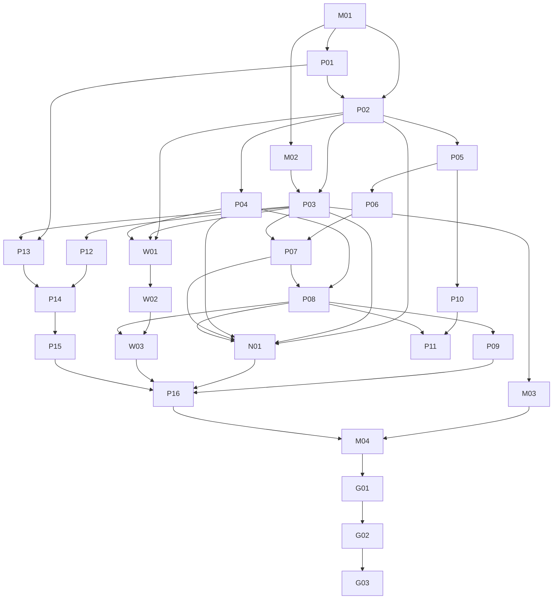

# “问天”AI信源探测系统实施计划

> 状态：已批准的实施预拆分。任务编号仍为方案内部编号，不等同于正式T任务。

## 1. 交付策略

采用七个可独立验收的阶段。先完成问天独立系统，再建设GEO连接器。GEO连接器不阻塞问天独立版MVP，也不允许反向改变问天核心数据模型。

## 2. 阶段与出口

| 阶段 | 目标 | 出口条件 |
|---|---|---|
| A 问天基础与契约 | 独立系统边界、数据、API、事件和指标固定 | contracts、迁移、OpenAPI评审通过 |
| B 单Provider闭环 | 一个搜索API从运行到来源下钻 | stub+受控灰度通过 |
| C 自述与消费端观察 | 声明偏好、网页端可见证据 | 独立口径、人工确认和隐私门禁通过 |
| D 第二Provider与对比 | Provider差异与多样本 | 独立运行、基线和成本正确 |
| E 爬虫日志 | 自有站点真实访问频率 | 导入、双重核验和趋势通过 |
| F 问天独立版发布 | 单组织系统完成生产部署闭环 | 安装、升级、备份恢复和运维门禁通过 |
| G GEO连接器 | SSO、绑定、同步和事件回传 | 连接器契约与故障隔离测试通过 |

## 3. 任务拆分

### 阶段A：契约与数据

**VIS-M01：问天独立系统边界冻结**

- 审批CHG-VIS-002；
- 冻结问天Web、API、Worker、数据库、队列、对象存储和本地身份边界；
- 冻结Principal、Project Scope、Query Set Snapshot、Usage、Audit、Event和Lifecycle契约；
- 明确问天首期为单组织、多项目系统；
- 明确GEO只能通过远程连接器API接入。

依赖：无。出口：ADR和独立部署设计评审通过。

**VIS-P01：方法与外部能力门禁冻结**

- 确认首批Provider、保留期、预算和条款；
- 发布方法版本和文案规范。

依赖：M01。出口：方法版本、Provider门禁和正式任务号。

**VIS-M02：问天scope与不可变问题集快照**

- 建立问天scope、query-set snapshot和不可变snapshot items；
- Repository只接受问天principal允许的 `scope_id`；
- 运行期间不读取GEO或其他外部问题集；
- 禁止问天schema指向GEO业务表的外键。

依赖：M01。出口：scope隔离、快照幂等和无跨schema硬依赖测试通过。

**VIS-P02：信源契约**

- 枚举、Zod Schema、API类型、事件类型；
- 指标可用性和错误码；
- Provider能力快照契约。

依赖：M01、P01。出口：contracts测试通过。

**VIS-P03：数据库迁移**

- 问天schema中的runs、responses、scope、query-set snapshot、usage record和Outbox；
- provider config、source events、nomination parse reviews、owned domains；domain-only提名使用必填source_key_hash；
- 约束、触发器、索引和迁移测试；
- 只支持问天空数据库安装与逐版本升级。

依赖：M02、P02。出口：问天空库安装与升级迁移通过。

**VIS-P04：URL归一化与指标库**

- 纯函数归一化；
- 引用、提名、消费端可见来源和爬虫描述性指标计算；
- 黄金数据测试。

依赖：P02。出口：单元测试与黄金结果一致。

**VIS-M03：问天本地身份、项目、用量与审计**

- 实现本地owner/admin/analyst/viewer登录与项目成员关系；
- 实现本地用量、预算、审计、导出和项目生命周期；
- 首次初始化令牌使用后永久失效；
- 不配置GEO时全部能力可用。

依赖：M01、M02、P03。出口：本地身份、权限和项目隔离测试通过。

### 阶段B：首个搜索Provider

**VIS-P05：SearchProbeAdapter Port**

- 统一输入输出；
- 错误、usage、capability模型；
- fixture contract harness。

依赖：P02。出口：stub provider通过。

**VIS-P06：OpenAI搜索Adapter候选**

- Responses Web Search调用；
- url_citation与sources/results解析；
- 真实模型ID、用量、请求ID；
- 条款字段白名单。

依赖：P01、P05。出口：fixture通过；真实灰度需单独授权。

**VIS-P07：多样本Probe Worker**

- 逐题逐样本执行；
- 幂等、部分成功、取消、用量；
- 来源事件事务写入。

依赖：P03–P06。出口：Worker集成测试通过。

**VIS-P08：API查询与OpenAPI**

- estimate、创建运行、运行来源、趋势和详情；
- cursor分页、权限和缓存；
- 生成SDK。

依赖：P03、P04、P07。出口：API契约测试通过。

**VIS-P09：问天联网信源UI**

- 概览、创建运行、运行详情、来源详情；
- 状态、样本警告、URL筛选、可访问性；
- 使用问天自身路由、会话、项目权限和API。

依赖：M01、P08。出口：问天Web E2E和a11y通过。

### 阶段C：信源自述与消费端观察

**VIS-N01：信源自述实验**

- experiment_kind与版本化自述提示词；
- unaided、search_assisted、surface_unknown上下文派生与隔离统计；
- nominated事件、确定性解析和人工复核；
- 提名率、首位提名率、稳定度和提名—引用重合；
- 不可核验内部抓取声明标记。

依赖：P02、P03、P04、P07、P08。出口：自述E2E与黄金指标通过。

**VIS-W01：消费端Surface与观察契约**

- web_observed枚举；
- consumer surface能力版本；
- 运行模式/执行目标/采集方式固定矩阵；
- 人工确认状态、证据等级和API模型等价映射；
- 观察任务、capture artifact和一次性token契约；
- 数据保留和隐私字段白名单。

依赖：P01–P04。出口：contracts、迁移与安全评审通过。

**VIS-W02：浏览器辅助采集与人工确认**

- 用户主动采集当前可见回答、引用和截图；
- 消费端现场人工粘贴/录入作为浏览器辅助不可用时的MVP路径；
- 页面适配器签名、上传前本地预览、脱敏和capture幂等；
- needs_review、confirmed、rejected闭环；
- 拒绝观察后的暂存证据隐私清除；
- web_confirmed_capture与web_confirmed_manual证据等级；
- 禁止凭证、Cookie、Token和隐藏网络响应采集。

依赖：W01。出口：采集集成、安全和隐私测试通过。

**VIS-W03：消费端观察UI与报告**

- 任务列表、采集工作台、预览确认和观察详情；
- Web端可见引用率、稳定度和exact/approximate/query_only API—消费端对照；
- 固定证据边界说明。

依赖：W02、P08。出口：消费端观察E2E与a11y通过。

### 阶段D：第二Provider与对比

**VIS-P10：Perplexity Sonar Adapter候选**

- citations和search_results解析；
- 能力、费用和错误映射；
- 条款字段白名单。

依赖：P01、P05。出口：fixture与受控灰度通过。

**VIS-P11：多Provider创建与基线比较**

- 一次请求创建多个独立运行；
- 配置一致性检查；
- Provider并列视图，不混合为单一权重。

依赖：P08、P10。出口：E2E通过。

### 阶段E：爬虫日志

**VIS-P12：Owned Domain验证**

- 项目域名、验证状态和权限；
- 首期验证方式由ADR确定。

依赖：P03。出口：跨scope和越界测试通过。

**VIS-P13：Crawler Identity Snapshot**

- 官方IP/UA规则获取；
- 快照、陈旧回退和双重核验；
- 不同bot类别分离。

依赖：P01、P03。出口：身份fixture通过。

**VIS-P14：日志预检与导入Worker**

- CSV模板、映射、流式解析、幂等；
- 私有对象、最小事实、错误统计；
- 安全测试。

依赖：P12、P13。出口：500 MiB上限内性能目标通过。

**VIS-P15：爬虫日志UI与趋势**

- 导入流程、趋势、URL覆盖、状态码；
- verified与ua_only强区分。

依赖：P14。出口：日志E2E与a11y通过。

### 阶段F：问天独立版发布

**VIS-P16：导出、scope生命周期和问天运维**

- CSV安全导出；
- scope导出/删除；
- 指标、告警、runbook和本地用量核对。

依赖：P09、N01、W03、P15。出口：发布门禁通过。

**VIS-M04：问天制品与独立部署验证**

- 构建问天Web、API、Worker、迁移和部署清单；
- 提供单组织首次owner初始化、项目管理和本地运维入口；
- 验证空环境安装、升级、备份恢复、健康检查和配置错误失败关闭；
- 不配置GEO连接器时完成完整E2E。

依赖：M03、P16。出口：问天独立版发布门禁通过。

### 阶段G：GEO连接器

**VIS-G01：连接器实例与项目绑定**

- 冻结 `wentian-geo-connector@1`；
- 实现连接器实例、凭证轮换，以及“GEO管理员发起、问天管理员审批”的项目绑定状态机；
- GEO侧增加连接状态页，不复制问天业务页面。

依赖：M04。出口：连接器认证、申请/审批、拒绝、暂停和解绑测试通过，非active状态不能SSO或同步。

**VIS-G02：一次性SSO与问题集同步**

- GEO后端申请60秒、一次性launch code；
- 问天建立第一方HttpOnly会话，按project binding隔离角色并冻结access version；
- GEO问题集同步为问天不可变快照；
- 票据重放、换项目和未知角色失败关闭。

依赖：G01。出口：SSO与同步契约/E2E通过。

**VIS-G03：Webhook、故障隔离与集成发布**

- 问天运行完成和高价值机会签名Webhook；
- event ID幂等、有界重试、死信和告警；
- GEO不可用、连接器吊销和解绑时问天核心继续可用；
- 发布连接器兼容矩阵和运维手册。

依赖：G02。出口：GEO集成发布门禁通过。

## 4. 关键依赖图

## 5. MVP切分建议

问天独立版完整MVP包含：M01–M04、P01–P09、N01、W01–W03、P12–P16，即完成独立系统基础、一个搜索Provider、信源自述、消费端观察、自有站点日志和发布运维闭环。P10–P11属于可选增强，G01–G03属于后续GEO集成里程碑，均不阻塞独立版发布。

若只完成M01–M03、P01–P09、N01、W01–W03，应标记为“问天联网信源预览版”，不得宣称系统已实现真实爬虫频率探测或已完成生产部署。

如果首个Provider的预算或条款门禁未完成，不应以浏览器自动化替代Provider API；`search_api` 必须保持disabled，交付也不得称为完整MVP。经独立surface条款批准后，`model_only` 和用户主动确认的 `web_observed` 仍可作为预览能力；历史 `imported` 数据只保持兼容读取。

## 6. 发布门禁

- 正式ADR和Provider条款评审完成；
- 问天独立部署基线冻结；
- contracts、迁移、OpenAPI无漂移；
- 问天空库安装、初始化、升级、备份恢复通过；
- 不配置GEO连接器时完整E2E通过；
- 单Provider真实低频灰度成功；
- 成本费率卡和预算保护可用；
- 所有指标通过黄金数据；
- scope隔离、会话安全、日志隐私、CSV和SSRF测试通过；
- UI固定披露文案存在；
- 信源自述不进入实际引用率，消费端观察未经确认不进入默认指标；
- 自述上下文不默认混合，确认状态和证据等级不共用字段；
- API—消费端无法证明模型等价时只返回query_only对照；
- 已授权站点日志导入、爬虫身份双重核验和趋势报告完整可用；
- 浏览器辅助采集无凭证、Cookie、Token和隐藏网络响应读取能力；
- 监控、告警、删除和恢复流程完成；
- 不存在“API结果=消费端结果”误标。

GEO连接器另有发布门禁：

- `wentian-geo-connector@1` 契约冻结；
- SSO过期、重放、换项目和未知角色测试通过；
- 项目绑定、问题集同步、Webhook签名与幂等测试通过；
- GEO停止、连接器吊销和解绑时问天核心继续可用；
- GEO连接器没有问天数据库、Redis、对象存储或Provider凭证。

## 7. 风险与缓解

| 风险 | 影响 | 缓解 |
|---|---|---|
| Provider返回字段变化 | 解析失败 | 能力版本+fixture+失败关闭 |
| 条款限制数据分析 | 无法上线 | Provider门禁，必要时禁用 |
| 样本小导致误判 | 产品决策错误 | 分母、样本警告、禁止显著性文案 |
| URL归一化错误 | 指标重复或合并错误 | 保留原始URL、版本化和黄金测试 |
| 伪造爬虫UA | 爬取频率虚高 | UA+官方IP双重核验 |
| 大日志耗尽资源 | 服务不可用 | 文件上限、流式解析、scope并发限制 |
| 成本失控 | 预算超支 | estimate、预算预留、题数/样本/并发上限 |
| 把API当消费端 | 报告误导 | 产品标签和固定披露 |
| 把自述当真实偏好 | 错误结论 | nominated独立事件与提名指标 |
| 消费端页面变化 | 误采或任务失败 | 页面签名门禁、人工确认、surface暂停 |
| 浏览器采集泄露账号数据 | 隐私和安全事故 | 字段白名单、区域截图、一次性token、删除重采 |
| 问天反向依赖GEO | 无法独立运行 | 独立基础设施、Integration API、断连可用性测试 |
| 问天范围膨胀为SaaS | 延期并增加安全复杂度 | MVP固定单组织，不建设注册、套餐或多租户运营能力 |
| SSO票据被重放、串项目或复用其他项目角色 | 越权访问 | 短有效期、单次消费、nonce、项目级访问映射/version、绑定校验和审计 |
| GEO回调失败 | GEO状态滞后 | 问天Outbox、签名、幂等、有界重试和死信告警 |
| GEO解绑误删问天数据 | 证据不可恢复 | 解绑只停集成，项目删除必须在问天显式执行 |

## 8. 开发前必须由产品确认

1. 首发启用的第一个Provider和model ID；第二Provider不阻塞MVP；
2. 默认样本数3是否接受对应成本；
3. 是否在MVP后增加通用外部数据集导入UI；消费端现场人工录入已纳入MVP；
4. 日志原文件与回答保留期；
5. 自有域名验证方式；
6. 首批支持的日志模板；
7. 是否将“从缺口创建Brief”纳入首发；
8. 对外产品名称和计费方式。
9. 首批消费端产品及浏览器辅助采集是否获得允许；
10. 消费端截图/DOM保留期和脱敏标准；
11. 信源自述提示词版本和Top-K默认值。
12. 问天首发部署形态、域名、备份目标和初始化秘密交付方式。
13. GEO连接器首发范围是否同时包含问题集同步和事件回传。
14. GEO角色到问天项目角色的映射与会话失效时限。
15. 问天与GEO的网络连通方式、签名算法和密钥轮换周期。
16. 首期绑定的GEO租户，以及未来是否需要多组织/多GEO租户能力；后者不进入MVP。
