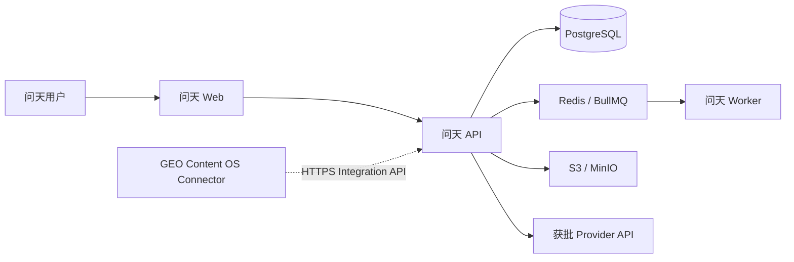

# “问天”AI信源探测系统独立部署设计

> 状态：已批准（`CHG-VIS-002`）  
> 决策：问天只有一种运行形态——完整独立部署  
> MVP边界：单组织、多项目，不是公共多租户SaaS

## 1. 目标

问天独立拥有身份、权限、项目、数据、任务、用量、审计和运维能力。即使GEO Content OS或GEO连接器不可用，用户仍可直接登录问天并完成全部核心业务。

GEO连接器是外部集成客户端，不属于问天运行依赖。问天不得要求GEO数据库、会话、Repository、队列或对象存储才能启动。

## 2. 最小生产拓扑



最小生产组件：Web、API、Worker、PostgreSQL、Redis和S3兼容对象存储。开发环境可合并进程，但数据模型、API和任务语义必须与生产一致。

## 3. 发布物

一次问天版本发布包含：

```text
wentian-web
wentian-api
wentian-worker
wentian-migrations
wentian-contracts
wentian-deployment-manifest
```

GEO连接器单独发布并声明兼容的 `wentian-geo-connector` 契约主版本。连接器升级不得要求重新构建问天核心制品。

## 4. 基础配置

启动时至少配置：

```text
WENTIAN_PUBLIC_BASE_URL=https://wentian.example.com
WENTIAN_DATABASE_URL=<secret>
WENTIAN_REDIS_URL=<secret>
WENTIAN_OBJECT_STORE_ENDPOINT=<endpoint>
WENTIAN_OBJECT_STORE_BUCKET=<bucket>
WENTIAN_SESSION_SECRET=<secret>
WENTIAN_ENCRYPTION_KEY=<secret>
```

Provider凭证、连接器凭证和首次管理员秘密只能通过部署环境或密钥服务注入，不进入前端、镜像默认值、日志或仓库。

## 5. 首次初始化

1. 执行问天数据库迁移；
2. 生成唯一系统实例ID；
3. 使用一次性初始化令牌创建本地组织和owner；
4. 使初始化令牌永久失效；
5. 创建首个项目；
6. 配置对象存储、保留期和至少一个获批Provider；
7. 执行健康检查和最小探测自检。

MVP不提供公开注册、多个组织、自助订阅、跨组织管理员或插件市场。一个问天实例最多激活一个GEO租户连接；多GEO租户需要问天多组织能力和独立ADR。

## 6. 身份与访问

- 本地用户通过问天自身登录进入；
- GEO用户通过连接器一次性SSO票据进入，最终仍建立问天第一方HttpOnly会话；
- GEO Cookie、Token或权限对象不得直接传入问天前端；
- SSO映射失败不影响本地owner登录；
- GEO外部身份与项目访问分别映射，同一用户在不同项目的角色和撤销状态互不共用；
- 每次请求由问天服务端principal校验项目成员关系，客户端提交的project ID不能证明权限。

## 7. 数据与升级

- 所有业务数据只写入问天数据库；
- 问天迁移只针对问天schema，不在GEO数据库执行；
- 问天支持空库安装、逐版本升级、升级前备份和失败恢复；
- GEO问题集同步后形成问天不可变快照，GEO后续修改不改变历史运行；
- GEO连接断开只停用SSO和同步，不自动删除问天项目或历史数据；
- 跨实例迁移必须使用显式导出包，保留快照哈希、方法版本和证据等级。

## 8. 健康检查与运维

必须提供：

- liveness：进程存活；
- readiness：数据库、队列、对象存储和迁移版本可用；
- provider status：Provider停用不使基础readiness失败；
- connector status：单独显示各GEO连接状态，不影响核心readiness；
- backup：数据库与对象存储一致性清单；
- restore：恢复后重算聚合并验证对象引用；
- version：Web、API、Worker、contracts和migration版本。

## 9. GEO故障隔离

- GEO不可用：本地登录、已有项目、探测、报告、日志和导出继续可用；
- 连接器凭证失效：只暂停SSO、问题集同步和事件回传；
- GEO回调失败：问天Outbox有界重试并告警，不回退已完成运行；
- GEO项目删除：只把binding标记为失联，必须由问天管理员明确归档或删除本地项目。

## 10. 发布验收

- 全新环境完成安装、初始化、运行、升级、备份和恢复；
- 不配置GEO连接器时全部核心功能可用；
- 停止GEO或阻断连接器网络后，核心readiness和既有运行不受影响；
- 不存在默认密码、默认API key或跨项目访问；
- 问天数据库、Redis和对象存储不向GEO直连开放；
- 连接器回调失败不会丢失问天核心事实或改变指标。
