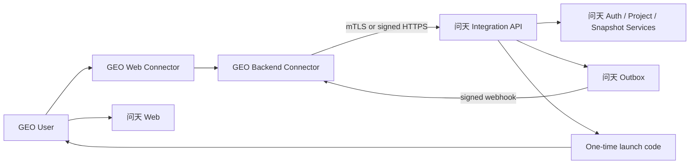

# “问天”与GEO Content OS连接器契约

> 状态：已批准设计基线  
> 契约名：`wentian-geo-connector@1`  
> 边界：只适用于GEO Content OS，不是通用插件协议

## 1. 目标与边界

GEO连接器让GEO用户进入问天并复用必要的项目上下文，但问天始终是独立系统。

连接器允许：

- 在GEO导航中显示“问天AI信源探测”；
- 创建短期一次性SSO票据；
- 显式绑定GEO项目与问天项目；
- 把GEO问题集同步为问天不可变快照；
- 接收问天运行完成、机会发现等最小事件；
- 在GEO中展示连接状态和跳转链接。

连接器禁止：

- 直连问天数据库、Redis或对象存储；
- 在GEO进程运行问天Worker或Provider Adapter；
- 共享Cookie、会话密钥或Provider凭证；
- 用GEO删除动作静默删除问天数据；
- 改变问天指标、证据等级或运行状态。

## 2. 组件与信任边界



浏览器不持有连接器client secret。所有项目绑定、问题集同步和票据签发都由GEO后端与问天Integration API完成。

## 3. 连接器实例

问天管理员显式创建GEO连接实例：

```ts
interface GeoConnectorInstance {
  id: string;
  geoInstanceRef: string;
  geoTenantRef: string;
  displayName: string;
  allowedGeoOrigins: readonly string[];
  callbackBaseUrl: string;
  status: 'active' | 'suspended' | 'revoked';
  contractVersion: 'wentian-geo-connector@1';
}
```

凭证只显示一次并加密保存。支持双密钥轮换窗口；吊销后立即拒绝新票据、同步和回调，不删除既有问天数据。

`callbackBaseUrl` 只能由问天管理员配置为HTTPS白名单地址；发送Webhook时不跟随重定向，并执行DNS/IP与目标端口校验，防止把连接器配置变成SSRF出口。

## 4. 项目绑定

```ts
interface GeoProjectBinding {
  connectorInstanceId: string;
  geoWorkspaceRef: string;
  geoProjectRef: string;
  wentianProjectId: string | null;
  status:
    | 'pending_wentian'
    | 'active'
    | 'suspended'
    | 'rejected'
    | 'disconnected';
  version: number;
}
```

绑定确认流程：

1. GEO管理员在当前项目发起绑定申请，GEO后端以连接器凭证提交GEO工作区、项目引用和显示名；
2. 问天保存为 `pending_wentian`，不向GEO暴露问天项目列表；
3. 问天管理员在问天连接器设置中查看申请，选择一个本地项目并批准，或填写原因拒绝；
4. 只有批准成功后binding才进入 `active`，GEO状态页随后允许同步和进入问天；
5. GEO管理员可撤回仍为 `pending_wentian` 的本项目申请；重新绑定必须先断开旧binding，再创建新binding ID并重新走申请与批准流程。

对应接口：

- GEO后端：`POST /api/v1/integrations/geo/project-binding-requests`；
- GEO后端撤回：`DELETE /api/v1/integrations/geo/project-binding-requests/{id}`；
- 问天管理员查询：`GET /api/v1/integrations/geo/project-binding-requests?status=pending_wentian`；
- 问天管理员批准：`POST /api/v1/integrations/geo/project-binding-requests/{id}/approve`；
- 问天管理员拒绝：`POST /api/v1/integrations/geo/project-binding-requests/{id}/reject`。

规则：

- 同一连接器实例下，一个GEO项目同时只能有一个待确认或有效binding；已拒绝/断开的旧binding保留且不得被新申请覆盖；
- MVP一个问天实例只允许一个active GEO连接器实例，且固定一个GEO租户；
- GEO管理员负责发起，问天管理员负责选择本地项目并批准；不按名称自动匹配，也不能单方直接创建active binding；
- GEO外部引用只保存在连接器表，不作为问天项目授权依据；
- 问天项目成员关系是最终授权事实；
- `pending_wentian`、`rejected`、`suspended` 和 `disconnected` 均禁止SSO与同步；
- 解绑停止SSO和同步，历史运行与证据继续保留。

## 5. 一次性SSO票据

流程：

1. GEO后端验证当前用户和项目权限；
2. GEO后端调用 `POST /api/v1/integrations/geo/sso-tickets`；
3. 问天验证连接器凭证、绑定和请求签名，创建60秒内有效、只能消费一次的launch code；
4. GEO浏览器跳转到 `https://<wentian>/connect/geo?code=<one-time-code>`；
5. 问天消费code，映射或创建受控用户绑定，建立问天HttpOnly会话；
6. 问天跳转到绑定项目页面，并记录SSO审计事件。

服务端请求至少包含：

```ts
interface GeoSsoTicketRequest {
  connectorInstanceId: string;
  geoUserRef: string;
  geoProjectRef: string;
  displayName: string;
  roleCodes: readonly string[];
  requestedPath?: string;
  nonce: string;
  issuedAt: string;
}
```

禁止把邮箱、手机号等身份字段作为唯一映射键；使用 `connector_instance_id + geo_user_ref`。票据必须校验issuer、audience、nonce、签名、允许来源、过期时间和单次消费状态。

`requestedPath` 只接受问天站内相对路径白名单，拒绝绝对URL、协议相对URL、反斜杠和编码绕过；最终跳转URL由问天服务端生成，防止开放重定向。

`/connect/geo` 响应必须设置 `Referrer-Policy: no-referrer`，消费页面不加载第三方脚本或分析像素；访问日志和错误日志必须脱敏code。消费成功后立即跳转到不含code的问天项目URL。

## 6. 权限映射

GEO连接器只把GEO角色映射为问天项目角色：

```text
GEO owner/admin   -> 问天 project_admin
GEO analyst       -> 问天 analyst
GEO viewer        -> 问天 viewer
其他或未知角色    -> 拒绝签发票据
```

问天把外部身份映射与项目访问映射分开保存。同一GEO用户可在不同project binding拥有不同角色，任何项目的角色更新都不能修改其他项目。票据签发时，问天更新该项目的访问映射与本地项目成员关系，并把 `bindingVersion + accessVersion` 写入票据和会话。

问天服务端在每次请求重新校验当前项目成员关系、binding active状态及访问版本。连接器传入的role只用于受控同步，不能直接成为客户端权限声明。GEO来源会话记录auth source、binding version与access version，MVP硬过期上限建议30分钟且不能脱离GEO重新长期续期；解绑或连接器吊销必须立即使相关会话失效，角色变化最迟在硬过期或下次SSO时生效。

## 7. 问题集同步

GEO后端调用：

`PUT /api/v1/integrations/geo/project-bindings/{id}/query-set-snapshots`

请求包含版本化问题集：

```ts
interface GeoQuerySetSyncInput {
  geoQuerySetRef: string;
  geoRevision: string;
  title: string;
  locale: string;
  market?: string;
  queries: readonly {
    externalKey: string;
    text: string;
    intent: string;
    commercialValue?: string;
  }[];
}
```

问天完成Schema校验、稳定排序、哈希和不可变保存。相同绑定与snapshot hash幂等返回原快照；运行只引用问天snapshot ID，不在执行期间回调GEO。

## 8. 事件回传

可选事件：

```text
wentian.run_completed.v1
wentian.high_value_gap_identified.v1
wentian.export_completed.v1
wentian.binding_disconnected.v1
```

问天Outbox向连接器配置的回调地址发送签名Webhook。事件只包含event ID、connector instance、binding ID、问天对象ID、状态、时间和跳转URL，不包含回答正文、API key、Cookie、日志原文或对象存储签名。

GEO按event ID幂等消费。回调失败执行有界重试和死信告警，不回退问天运行终态。

## 9. GEO侧入口与UI

MVP在GEO增加一个轻量入口页，展示：

- 问天连接状态；
- 当前项目绑定状态；
- 最近同步的问题集版本；
- “进入问天”按钮；
- 管理员可见的重新绑定、重试同步和断开连接动作。

完整探测、报告和配置页面由问天Web提供。MVP不复制问天页面、不使用iframe，也不要求前端模块联邦。未来若需要原生嵌入，必须单独评审，不改变问天作为唯一运行系统的边界。

## 10. 断开与生命周期

- 暂停：拒绝新SSO和同步，保留binding；
- 断开：撤销该binding的项目访问映射和GEO来源会话，把binding标为disconnected；不撤销连接器实例凭证，也不影响同一GEO租户下其他active binding；
- GEO项目删除：发送解绑通知，但不自动删除问天项目；
- 问天项目删除：先撤销绑定，再按问天本地删除流程清理数据；
- 重新连接：必须由管理员确认，不按旧外部引用自动恢复。

## 11. 错误与幂等

最小错误码：

```text
GEO_CONNECTOR_UNAUTHORIZED
GEO_CONNECTOR_SUSPENDED
GEO_BINDING_NOT_FOUND
GEO_BINDING_CONFLICT
GEO_SSO_TICKET_EXPIRED
GEO_SSO_TICKET_REPLAYED
GEO_ROLE_NOT_MAPPED
GEO_QUERY_SET_INVALID
GEO_CALLBACK_UNAVAILABLE
GEO_CONTRACT_VERSION_UNSUPPORTED
```

绑定、同步、票据签发和回调均要求请求ID与幂等键。跨绑定资源统一404；签名错误返回401；有绑定访问权但动作权限不足返回403。

## 12. 版本与验收

- 契约采用独立语义版本；
- 同一主版本只允许新增可选字段或事件；
- 改变签名、票据、权限或绑定语义必须发布新主版本；
- 问天至少兼容当前和前一个已发布连接器小版本；
- 不兼容主版本必须失败关闭，不能自动降级。

契约测试至少覆盖：

- SSO票据过期、重放、换项目和换连接器均失败；
- launch code不进入访问日志、错误日志、Referer或第三方请求；
- requestedPath不能形成外部跳转或越过绑定项目；
- 项目绑定唯一且不能按名称猜测；
- 已断开的binding保留历史引用，重新绑定使用新ID；
- 同一GEO用户在两个项目的不同角色不会串用；
- 其他GEO租户的项目、用户或同步请求均被拒绝；
- 角色映射和降级生效；
- 连接器吊销/解绑立即终止GEO来源会话，角色变化不超过约定硬过期窗口；
- 问题集同步幂等且生成不可变快照；
- 回调签名、幂等、重试和敏感字段白名单正确；
- callback地址白名单、DNS/IP校验和禁止重定向可阻止SSRF；
- GEO不可用时问天核心功能和readiness正常；
- 解绑不会静默删除问天数据；
- 连接器无法访问问天数据库、队列、对象存储或Provider凭证。
